# Dataset design

- Author:
  Simon Heybrock

- Prototype review:
  Owen Arnold,
  Martyn Gigg

- Design document reviewers:
  Owen Arnold,
  Lamar Moore,
  Neil Vaytet

## Contents

- [Context](#context)
- [High level design overview](#overview)
  - [Why not `xarray`?](#overview-why-not-xarray)
  - [Examples](#overview-examples)
  - [Elements](#overview-elements)
  - [Operations](#overview-operations)
  - [Relation to existing workspace types](#overview-relation-to-existing-workspace-types)
  - [Python exports](#overview-python-exports)
- [Design components](#design-components)
  - [`class Dataset`](#design-components-dataset)
  - [`class Variable`](#design-components-variable)
  - [Variable tags](#design-components-variable-tags)
  - [`class Dimensions`](#design-components-dimensions)
  - [Dimension tags](#design-components-dimension-tags)
  - [`class DatasetView`](#design-components-datasetview)
  - [`class DatasetIndex`](#design-components-datasetindex)
  - [Units](#design-components-units)
  - [Exceptions](#design-components-exceptions)
- [Examples](#examples)
  - [Python examples](#examples-python)
  - [C++ example](#examples-cpp)
- [Design details](#design-details)
  - [Dependencies](#design-details-dependencies)
  - [Unit tests](#design-details-unit-tests)
  - [Benchmarks](#design-details-benchmarks)
  - [Sanitizers](#design-details-sanitizers)
  - [Code review](#design-details-code-review)
  - [Documentation](#design-details-documentation)
  - [Scope and extension](#design-details-scope-and-extension)
  - [API stability](#design-details-api-stability)
  - [Naming](#design-details-naming)
  - [Attributes](#design-details-attributes)
  - [Copy-on-write mechanism](#design-details-copy-on-write-mechanism)
  - [Uncertainties are stored as variances, not standard deviations](#design-details-uncertainties-are-stored-as-variances)
  - ["Distributions" and "histogram data" are distinguished by their unit](#design-details-distribution-histogram-distinguised-by-unit)
  - [No progress reporting an no cancellation](#design-details-no-progress-reporting-no-cancellation)
  - [No support for histograms with varying length](#design-details-no-length-variation)
  - [Operations are threaded using OpenMP](#design-details-threading)
  - [No magic](#design-details-no-magic)
  - [No logging](#design-details-no-logging)
  - [Operations have strong exception guarantee or clear data if only a basic exception guarantee can be given](#design-details-exception-safety)
  - [No processing history, for the time being](#design-details-no-processing-history)
  - [Floating-point precision can be set at compile time](#design-details-floating-point-precision-compile-time)
  - [Performance opportunities](#design-details-performance-opportunities)
  - [Slicing](#design-details-slicing)
  - [Supporting libraries](#design-details-supporting-libraries)
- [Implementation](#implementation)
  - [Implementation path](#implementation-path)
    - [Phase 1](#implementation-phase-1)
    - [Phase 2](#implementation-phase-2)
    - [Phase 2+WB](#implementation-phase-2-wb)
    - [Phase 2+X](#implementation-phase-2-x)
  - [Notes on reuse](#implementation-notes-on-reuse)
  - [Goals and non-goals](#implementation-goals-and-non-goals)
  - [Milestones](#implementation-milestones)
  - [Effort](#implementation-effort)
    - [Phase 1](#implementation-effort-phase-1)
    - [Phase 2](#implementation-effort-phase-2)
    - [Phase 2+WB](#implementation-effort-phase-2-wb)
    - [Phase 2+X](#implementation-effort-phase-2-x)
- [Discussion](#discussion)
  - [Impact](#discussion-impact)
  - [New challenges](#discussion-new-challenges)
  - [Summary](#discussion-summary)
- [Further reading](#further-reading)


## <a name="context"></a>Context

This document describes a proposed new library, to become part of the Mantid project.
The working title of the project that led to the design proposed in the following has been **Workspace-2.0**, i.e., the set goal was to find a way to improve upon the workspace types that are currently available in Mantid.
For reasons that will become clear below we adopt the title `Dataset` instead of the old working title.

Before starting the design and prototyping phase, [comments about the current implementation and requirements for the new design](https://github.com/mantidproject/documents/blob/master/Project-Management/CoreTeam/workspace-notes.md) had been gathered.
For a big picture of the current situation, consider the class inheritance diagram for the existing workspaces in Mantid:

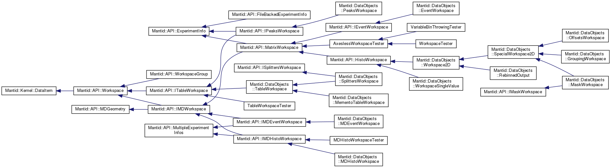

To put this diagram in perspective, note that one major point of criticism of the current implementation was "not enough workspace types", i.e., for the redesign an even larger variety was requested.
Based on these requirements a design and prototyping process was started in early 2018.
Initially a couple of different options have been prototyped but it soon became apparent that only one of them was a real option.
We refer to the [early prototype documentation](https://github.com/mantidproject/workspace-sandbox) for details on the abandoned options and why they were abandoned.
In agreement with reviewers of those early investigations, effort has thus been mostly focused on the `Dataset` option, described below.

Altogether, as of 2018-10-10, a total of 65 working days (approx 3.5 FTE months) have been invested in the design and prototyping process.
We also refer to the [prototype development notes](development-notes.md) for more details and motivation of the features presented in the following.


## <a name="overview"></a>High level design overview

We propose a new class called `Dataset`, with the capability to replace almost all existing workspaces types while at the same time providing more features and more flexibility.
The inspiration for `Dataset` comes from the `Dataset` type in [xarray](http://xarray.pydata.org/en/stable/).

Quoting from the website:
*"**xarray** (formerly **xray**) is an open source project and Python package that aims to bring the labeled data power of pandas to the physical sciences, by providing N-dimensional variants of the core pandas data structures."*

`xarray.Dataset` is roughly speaking a `dict` of `numpy.ndarray` objects with labeled coordinates and dimensions.
Our design adds features that are not present in `xarray.Dataset` but represent the core of what Mantid provides to neutron science: Handling histograms of (neutron) data, handling of physical units, and propagation of uncertainties.
Note that the proposed design is *not* a 1:1 copy of `xarray.Dataset`, there are some significant differences.
Furthermore, it will be written in C++ with Python exports for optimal performance and flexibility.

As described in this document, `Dataset` should be able to replace all of our workspace types (for `MDEventWorkspace` there is not significant advantage to using the new design since data in `MDEventWorkspace` has a tree structure).
This includes not just `MatrixWorkspace` and its child classes `Workspace2D` and `EventWorkspace` but also `TableWorkspace`, `PeaksWorkspace`, and `MDHistoWorkspace`.
In addition, `Dataset` can likely also replace `Histogram`, `EventList`, and data structure introduced as part of **Instrument-2.0**.
`Dataset` provides a *uniform interface* in a *single type* for all of these.
Furthermore, `Dataset` covers many other cases that are currently impossible to represent in a single workspace or in an intuitive manner.

It should be noted at this point that the API of `Dataset` is not compatible with the API of the existing workspaces it would be replacing.
Therefore, this proposal also implies that basic algorithms would need to be reimplemented.
Higher-level algorithms such as workflow-algorithms may be ported or refactored, but this will depend on the strategy we pick for implementation and rollout, see [Implementation](#implementation).


### <a name="overview-why-not-xarray"></a>Why not `xarray`?

Given the similarity to `xarray.Dataset` we need to justify why we should not simple use `xarray`.
For our purposes the following is missing in `xarray`:

- Unit handling.
- Propagation of uncertainties.
- Support of histograms, i.e., we cannot have a bin-edge axis, which is by 1 longer than the other variables in that dimension.
- Support for event data.

Probably many of these things could be added to `xarray`, but the involved complexities imply that the resulting effort is not less than a from-scratch implementation. Furthermore, `xarray` seems to be less than 5 years old with very few active contributors, so building everything on top of it is an additional (albeit probably small) risk.

Furthermore, while `xarray` uses `numpy` internally and performance is thus adequate in many situations, having a C++ library enables us to get maximum performance if needed, i.e., there are better opportunities for performance improvements.


### <a name="overview-examples"></a>Examples

We begin with a series of examples.
If clarification is needed, please first read the [following section](#overview-elements) for a description of the nomenclature and underlying objects.
Labels in the figures use a Python-like syntax and naming is preliminary.

##### A basic dataset containing two variables, a coordinate and data

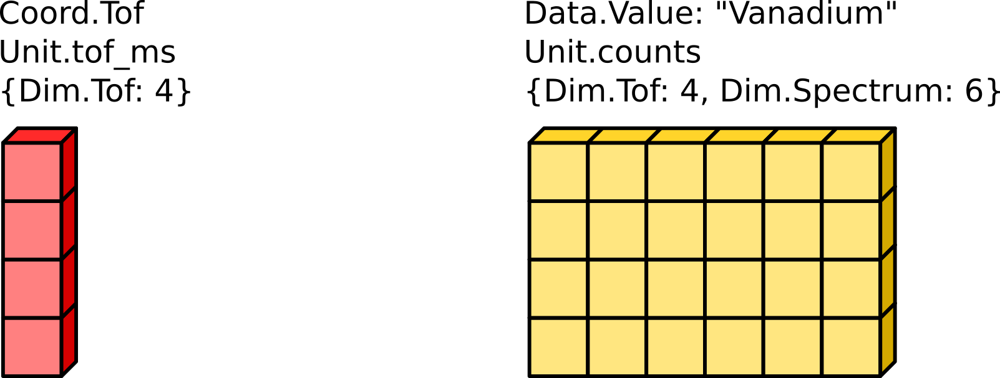

##### Coordinates can be bin-edges, i.e., their extent can be longer by one than the corresponding dimensions of other variables

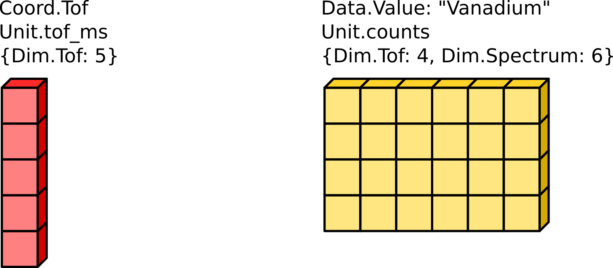

##### Coordinates do not need to be one-dimensional, i.e., they can represent a non-shared "X", as we are used to from `API::MatrixWorkspace`

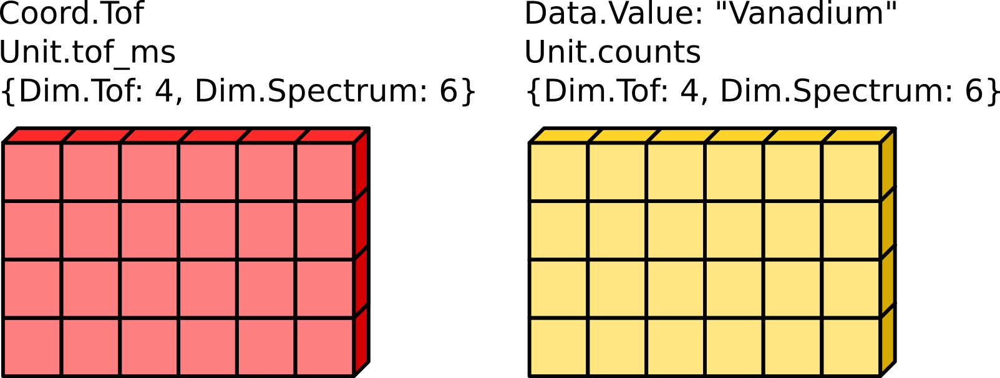

##### More coordinates can be added, e.g., for other dimensions

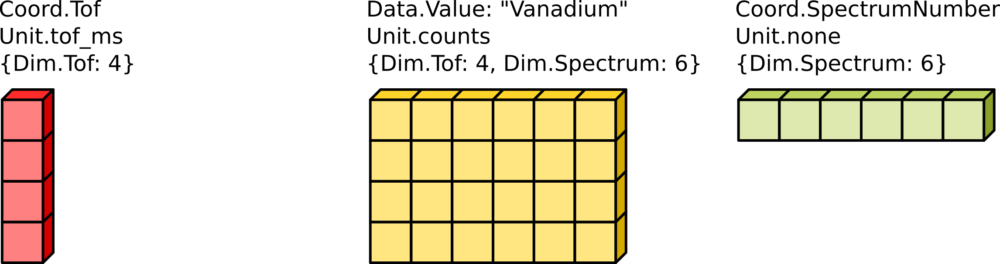

##### Multiple coordinates for the same dimension are also possible, as long as the coordinate tag is different, e.g., the final energy `Ef` in a spectrometer

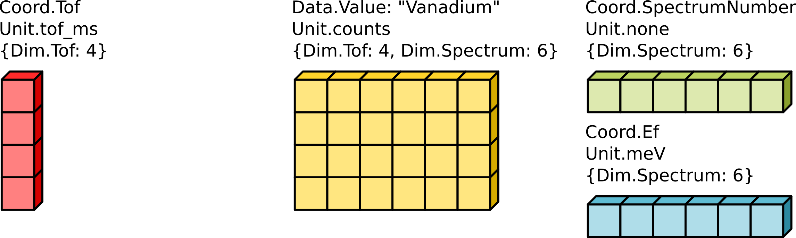

##### Variables can be zero-dimensional


##### Variables can have more dimensions if needed, e.g., for multi-period data or scan data

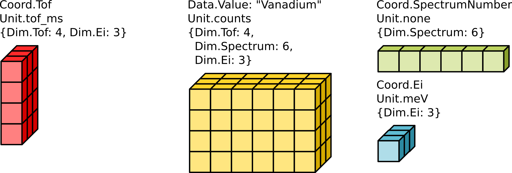

##### Multiple data variables of the same type are supported by a different name

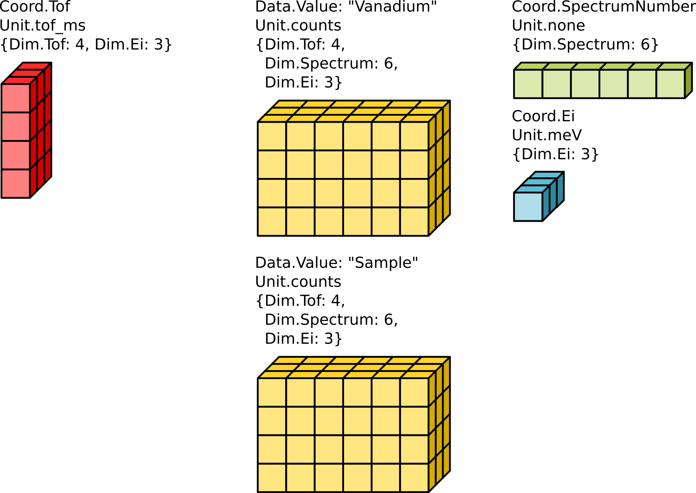


### <a name="overview-elements"></a>Elements

`class Dataset` is the top level entity.
It simply set of variables, instances of `class Variable`.
`Variable` contains:
- Tag and name identifying the variable.
- Unit of the data held by the variable.
- Dimensions of the data held by the variable, i.e., the side lengths of a multi-dimensional cube of data, using `class Dimensions`.
- Data, stored in an array-like container.

The dimensions of the variables in a dataset can differ, but the extents of the individual dimensions must match.
*Example: A one-dimensional variable with `Dim::X` and a two-dimensional variable with `Dim::X` and `Dim::Y` in the *same* dataset.
The respective extents of `Dim::X` must match.*
*Exception:
Coordinates can represent bin edges.
In that case the extent will be larger by 1.*
*Note: Matching dimensions refers only to matching *extents*.
We *do* explicitly support *multi-dimensional* coordinates to implement the current "ragged"-workspace behavior of `Workspace2D`, where the X axis for every histogram can be different ([with exception of its length](#design-details-no-length-variation)).*
A zero-dimensional variable corresponds to a point, i.e., it will contain a single data item.

Variables come in two classes, distinguished by their tag:
Coordinate variables and data variables.
This distinction enables a simple but effective definition of the behavior of `Dataset` in (arithmetic) operations:
- *Data variables* are *transformed*, e.g., subtracted in a "subtract" operation.
- *Coordinate variables* are *matched*.

As a simple example, consider subtracting two histograms:
We need to check that the X values match, and then subtract the Y values, i.e., the X values are coordinates, the Y values are data.

Examples of tags for data variables are:
- `Data::Value`
- `Data::Variance`
- `Data::String`
- `Data::Int`

Examples of tags coordinate variables are:
- `Coord::Tof`
- `Coord::dSpacing`
- `Coord::Q`
- `Coord::SpectrumNumber`
- `Coord::DetectorId`
- `Coord::SpectrumPosition`
- `Coord::DetectorPosition`
- `Coord::DetectorGrouping`
- `Coord::RowLabel`
- `Coord::X`, `Coord::Y`, `Coord::Z`
- `Coord::Qx`, `Coord::Qy`, `Coord::Qz`
- coordinates related to experiment environment parameters such as `Coord::Polarization` and `Coord::Temperature`
- `Coord::Mask`

The tag defines the underlying data type.
Experiment logs (`API::Run` in Mantid) are probably a special case, see the section on [Attributes](#design-details-attributes) below.

We furthermore define:
- Coordinate variables generally do not have a name and are thus identified only by their tag.
  Since `Dataset` is a set this implies that there cannot be two coordinate variable with the same tag in the same dataset.
  *Example: Having two variables `Coord::X` representing an X coordinate in a dataset is forbidden, and would indeed not make sense.*
  However, we may also want to support names for coordinates, there are two cases for this:
  - User defined coordinates, i.e., coordinates that do not have a matching tag.
  - Experiment logs, e.g., multiple temperature sensors.
    This probably applies only if we intend to use `Dataset` in place of `API::Run`.

- Coordinate variables have an implicit unit that cannot be changed (at least apart from its scale) since it is implied by the tag defining the coordinate.
  *Example: The X coordinate would always have a unit representing a *length*, e.g., `m` or `mm`.*
- Data variables have a name in addition to their tag.
  *Example: We can have a data variable holding neutron counts in `Data::Value` fom the "sample" run and a data variable holding counts for the "can" run in the *same* dataset.*

The name of data variables is furthermore used to imply a grouping of variables.
*Example: In a dataset containing data variables `Data::Value` and `Data::Variance` a matching variable name implies that the uncertainties stored in `Data::Variance` are associated with the data stored in `Data::Value`.*

The data in `Variable` is held by a type-erased handle, i.e., a `Variable` can hold data of any type.
The data handle also implements a copy-on-write mechanism, which makes `Variable` and `Dataset` cheap to copy and saves memory if only some variables in a dataset are modified.


### <a name="overview-operations"></a>Operations

Alongside the new `Dataset` type a series of basic and common operations will be provided.
A mostly but not entirely complete list of operations to be supported is:
1. Arithmetic operations: unary `-`, binary `+`, `-`, `*`, `/`
1. `transpose`
1. `slice` and `dice`
1. `concatenate` and `merge`
1. `sort`
1. `rebin`
1. `convert` (unit and/or dimension)
1. `filter`
1. Boolean/logical operations for mask operations
1. `integrate`
1. Basic statistics operations such as min, max, mean, and standard deviation

As discussed earlier, coordinate variables are not operated on in operations between datasets.
To modify a coordinate variable, we operate directly on the variable-level.


### <a name="overview-relation-to-existing-workspace-types"></a>Relation to existing workspace types

From the above description it may not be clear how `Dataset` is used to replace existing workspace types or components so we take a break to give some examples.
For clarity, in the following we are explicitly giving the current Mantid namespace names such as `API`, `DataObjects`, `Geometry`, and `Algorithms` when referring to types from the existing implementation.

##### DataObjects::TableWorkspace


A dataset where all variables are one-dimensional is a table.
- Each variable is a column.
- The variable name is the column label.
- `Coord::RowLabel` can provide a row label.
- `concatenate` is used to append one table to another.
- `merge` combines columns from two tables into one.
- `slice`, `dice`, or `filter` extract a new table with one or more rows.
- `sort` sorts the table.
- Coordinate and name matching enables mathematical operations on individual table columns.

See also the [working example](../test/TableWorkspace_test.cpp).

##### DataObjects::MDHistoWorkspace

A dataset with multi-dimensional variables `Data::Value` and `Data::Variance` in combination with a corresponding number of one--dimensional coordinate variables is a close equivalent to the current `DataObjects::MDHistoWorkspace`.
A typical example would be three-dimensional `Data::Value` and `Data::Variance` alongside one-dimensional `Coord:Qx`, `Coord:Qy`, and `Coord::Qz`.
- Can have coordinates that are bin edges or center points.
- Can have non-uniform binning.

##### DataObjects::Workspace2D

A dataset with two-dimensional variables `Data::Value` and `Data::Variance` in combination with a one- or two-dimensional variable `Coord::Tof` is a close equivalent to the current `DataObjects::Workspace2D`.
- Typically `Data::Value` and `Data::Variance` would both have dimensions `Dim::Tof` and `Dim::Spectrum`.
- If `Coord::Tof` has only `Dim::Tof`, it corresponds to a `DataObjects::Workspace2D` with shared X axis, if it also has `Dim::Spectrum` X is not shared.
- To represent bin edges, the extent of `Coord::Tof` in `Dim::Tof` is larger by one than `Dim::Tof` of the other variables.
- `Coord::SpectrumNumber` provides a spectrum number (currently in `API::ISpectrum`).
- Mapping from spectra to detectors (currently in `API::ISpectrum`) can be added using `Coord::DetectorGrouping`.
  For representing the instrument see the corresponding section below.
- Data from `API::ExperimentInfo` such as `API::Run` can be held by zero-dimensional variables such as `Data::ExperimentLog`.
- Masking of complete spectra or individual bins support by one- or two-dimensional variables such as `Coord::Mask`.

Most basic operations have an obvious mapping to what our current basic algorithms are doing.

See also the [working example](../test/Workspace2D_test.cpp).

##### Geometry::DetectorInfo, Geometry::ComponentInfo, and Geometry::Instrument

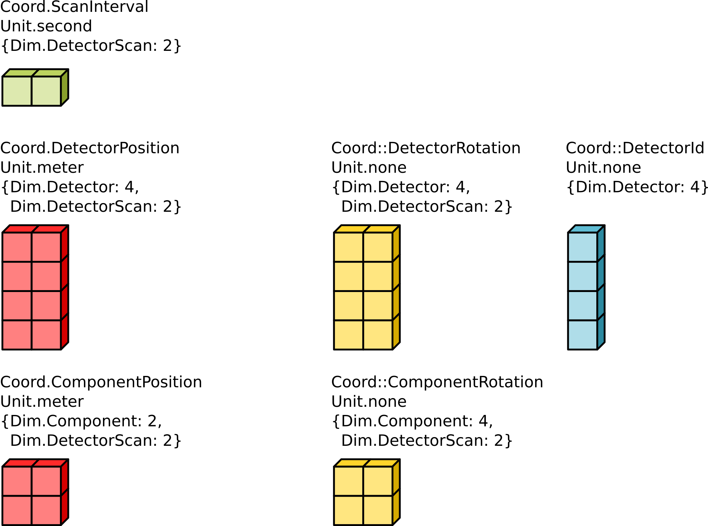

`Geometry::DetectorInfo` and `Geometry::ComponentInfo` are the result of the refactoring effort as part of **Instrument-2.0**.
Thanks to that refactoring, the underlying data is already stored in a structure of vectors, which can be mapped to variables in a dataset in an almost 1:1 manner.
- In place of `Geometry::DetectorInfo`, several variables with `Dim::Detector` would be added to a dataset.
  - `Coord::DetectorPosition` to store positions, `Coord::DetectorRotation` to store rotations, ...
- The option to have multi-dimensional variables will provide support for instruments with (synchronously) scanning detectors in a natural way.
  - Variables such as `Coord::DetectorPosition` can have the additional `Dim::DetectorScan` (in addition to `Dim::Detector`).
  - Time intervals for the scan can be stored in an additional variable `Coord::TimeInterval`.
- Data for `Geometry::ComponentInfo` can be mapped to variables in the dataset in a similar manner.
- `Geometry::Instrument` still exists as part of the pre-**Instrument-2.0** legacy.
  For the time being it can be supported by simply holding it in a zero-dimensional variable.

##### HistogramData::Histogram

`Dataset` will store histogram data as a single multi-dimensional array, i.e., *not* as a variable holding histograms.
However, we may still want to operate on a single histogram at a time in some cases.
A dataset with one-dimensional data variables `Data::Value` and `Data::Variance` alongside a one-dimensional coordinate variable such as `Coord::Tof` is a histogram.
- Arithmetic operations as well as many of the other basic operations support most of what would be required from a histogram type.

##### DataObjects::EventWorkspace

In contrast to histograms in `DataObjects::Workspace2D`, the event lists stored in `DataObject::EventWorkspace` have varying length.
Therefore, the events cannot be stored as a single multi-dimensional array.
- A one-dimensional variable `Data::Events` with `Dim::Spectrum` holds the lists of the events.
- The lists of events is a type similar to `DataObjects::EventList`.
  One option is to use `Dataset` for this, that is the dataset would contain many datasets, one for each event list.

See also the [working example](../test/EventWorkspace_test.cpp).

##### DataObjects::EventList

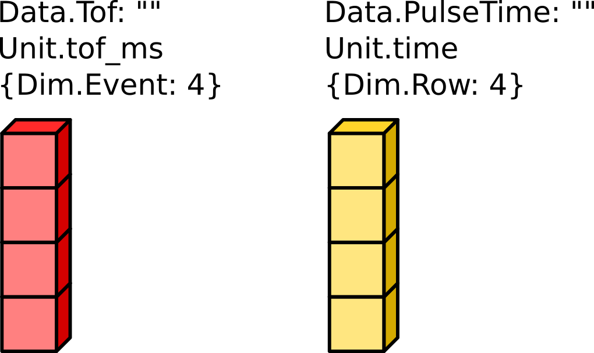

A one-dimensional dataset without coordinate variables can be used to represent an event list.
- `Dim::Event` is used as the only dimension for all variables.
- `Data::Tof` and `Data::PulseTime` make up the key part of data.
- Extra variables can be added to support weighted events.
- `concatenate` provides a merge operation.
- `sort` provides sorting by time-of-flight or pulse-time.
- `filter` provides filtering by time-of-flight or pulse-time.

##### DataObjects::WorkspaceGroup

`Dataset` does in general not intend to replace all uses of `DataObjects::WorkspaceGroup`.
Nevertheless the design implies that many of the current use cases will be eliminated:

- Several runs? -> Use extra dimension.
- Several samples? -> Use several variables.
- Sample and background? -> Use several variables.
- Fit results? -> Add a several new variables.
- Polarization? -> Use extra dimension or use multiple variables.

Some use-cases of `WorkspaceGroup` may be left, and depending on how we integrate Dataset and its algorithms into Mantid we may just continue using the current `API::Algorithm` and `WorkspaceGroup` for those cases.


### <a name="overview-python-exports"></a>Python exports

All relevant high-level classes and functions are fully exposed via a Python interface.
- The C++ API is modern and is thus easily mapped to a "pythonic" dataset library.
- `Dataset` itself is very similar to Python `dict`.
- Data of variables containing plain old data such as floating point values is exposed as readable and writable `numpy.ndarray`.
  These are true multi-dimensional arrays, i.e., in contrast to the current `API::MatrixWorkspace::readX()` and `API::MatrixWorkspace::dataX()` it is *not* a separate array for every spectrum.


## <a name="design-components"></a>Design components

The following is only an incomplete description.
For more details and examples the prototype code serves as a reference.
A good starting point that gives an overview of how `Dataset` may be *used* is given by [`TableWorkspace` example](../test/TableWorkspace_test.cpp), [`Workspace2D` example](../test/Workspace2D_test.cpp), and [`EventWorkspace` example](../test/EventWorkspace_test.cpp).


### <a name="design-components-dataset"></a>`class Dataset`

`class Dataset` is literally just a set or list of variables.
- Variables can be inserted and removed.
- Iteration over variables is possible.
- Variables are identified by a combination of their tag and (for data variables) their name.
  Duplicate tag/name combinations are forbidden, i.e., `Dataset` behaves like a set.

The current implementation also contains a `Dimensions` objects, holding the space spanned by the combination of all the variables dimensions.
However, this is not necessary and may change in the actual implementation.

There are very few methods for direct manipulation of `Dataset`:
- `setSlice` to set a slice of the dataset.

The current implementation in the prototype is mostly complete regarding the actual `Dataset` interface.
Most other functionality would probably be added as free functions.
- Some interface cleanup for finding variables or checking for existence of certain tags/names is required.
- `merge` is currently a member method, but should probably be made a free function.
  Given the copy-on-write mechanism there is no advantage in having it as a method.
- Insertion mechanism for bin-edge variables needs to be clarified.


### <a name="design-components-variable"></a>`class Variable`

`class Variable` can hold a N-dimensional array of arbitrary data, with some additions that make it self-describing:
- Tag and name identifying the variable.
- Unit of the data held by the variable.
- Dimensions of the data held by the variable, i.e., the side lengths of a multi-dimensional cube of data, using `class Dimensions`.
- Data, stored in an array-like container.

In the current implementation, as much as possible has been moved out of the header to reduce compile times due to templated code.
The interface implemented currently should be mostly complete with little change required for the final implementation.

##### Type erasure

The type erasure and implementation of basic operations for `Variable` uses **concept-based polymorphism** (a pattern by Sean Parent).
The involved types are `class VariableConcept` (the interface) and `template <class T> class VariableModel` (the implementation(s)).

##### Alignment

In the prototype we align the storage of data in `Variable` to support vectorization.
There is no disadvantage to this apart from preventing move operations when initialized from a `std::vector`.
In case alignment shows no actual advantage for performance in practice we can consider removing this feature.


### <a name="design-components-variable-tags"></a>Variable tags

Variables are identified by their tag, such as `Coord::X` and `Data::Value`.
Tags are also used for `const`-correct access, e.g., for avoiding triggering a copy or joint iteration with lower-dimensional variables.
Therefore the tags are not and `enum` but a class.
This lets us use things like `dataset.get<const Coord::X>()` instead of a less intuitive `dataset.get<Coord::ConstX>()`.


### <a name="design-components-dimensions"></a>`class Dimensions`

`class Dimensions` is an ordered list of dimension names alongside the dimension's extent, i.e., it defines a N-dimensional volume.
Furthermore it provides means of operating with dimensions, such as checking if a dimension is contained, merging dimensions, checking for subspaces, and dimension ordering.
The prototype implements very little of this in a clean way, and the API should probably be redone from scratch.
In many cases the code is scattered around the project, in the implementation of individual operations.
This is to be cleaned up when implementing the full set of operations.

At a later point, a small extension of `Dimensions` can provide support for multi-dimensional chunking/partitioning.
This could enable MPI support, cache blocking for more efficient use of the CPU caches, and working with data that does not fit into memory.
- Store the full dimension extent in addition to the chunk extent in `Dimensions`.
- If a dimension of a dataset represents just a subsection of the full dimension extent we use a special dimension tag.
- Operations that operate on a particular dimension will then fail.
  *Example: `Algorithms::DiffractionFocussing` requires `Dim::Spectrum`.*
- Based on the stored full dimension extent we can assemble a dataset from chunks, or provide a multi-step operation that can deal with partial dimensions and does the assembling process.
  *Example: A version of `Algorithms::DiffractionFocussing` that first focusses within each chunk and merges focussed data from all chunks in a final step.*


### <a name="design-components-dimension-tags"></a>Dimension tags

A dimension is identified by a tag.
This is simply an `enum class Dim`.

An incomplete list of dimension tags:
- `Dim::X`, `Dim::Y`, `Dim::Z`.
- `Dim::Qx`, `Dim::Qy`, `Dim::Qz`.
- `Dim::Detector`
- `Dim::Spectrum`
- `Dim::Tof`
- `Dim::Wavelength`
- `Dim::DetectorScan`
- `Dim::Temperature`
- `Dim::Polarization`
- `Dim::Run`
- `Dim::Row`
- `Dim::Event`

In many cases there is a corresponding coordinate tag for a dimension.


### <a name="design-components-datasetview"></a>`class DatasetView`

Due to the type-erasure we cannot simply treat `Dataset` as an array of structs, i.e., there is no equivalent to `API::MatrixWorkspace::getSpectrum(const size_t index)`.
If only access to a single variable is required it can be accessed directly.
For cases that require joint access to multiple variables we provide `class DatasetView`:
- Effectively provides a "zip-iterator", with support for automatic on-the-fly broadcast or transposition of dimensions.
- Nested view allows for accessing a histogram-like view.
- Allows for joint iteration with bin-edge variables using a `Bin` wrapper, overcoming the old nuisance of having `length+1` bin edges.
  See the [C++ example](#examples-cpp) for an example of how this would be used.

The current implementation seems to support all required features.
Performance was originally a problem due to the multi-dimensional iteration, but has subsequently been optimized to the point where it should be sufficient for most applications.


### <a name="design-components-datasetindex"></a>`class DatasetIndex`

`class DatasetIndex` is a simple helper to index slices in a dataset via values in an axis (coordinate).
`Dataset` itself makes no attempt at keeping values in a coordinate variable validated.
For example, there is no check for duplicate spectrum numbers.
Therefore, direct indexing is not possible.
Instead `DatasetIndex` builds the index (and does the validation) on demand when constructed.

##### Rationale

I tried to *maintain* consistent indices like spectrum numbers using code in `Indexing::IndexInfo`, but it turned out to be really complicated when integrating it into `API::MatrixWorkspace`.


### <a name="design-components-units"></a>Units

Internally the prototype uses `boost::units`, but we require run-time units.
It is therefore wrapped in a class that simply stores an unique ID for every unit.
- Arithmetic operations branch off using the ID, relying on `boost::units` for the actual work.
- Probably need to add support for units scales.

Very little of this is implemented in the prototype apart from the most basic examples.
This will probably require a not insignificant amount of work to get right to make sure we capture all the subtleties.
See for example [An issue with distributions and dimensionless units](https://github.com/mantidproject/documents/blob/fix-divide-distribution/Design/DistributionsAndDimensionlessData.md) for a recent issue relating to this in Mantid.


### <a name="design-components-exceptions"></a>Exceptions

The prototype currently simply throws `std::runtime_error` in most cases.
We should most likely add a clear range of exception types that provide useful information such as indices about the failure.


## <a name="examples"></a>Examples


### <a name="examples-python"></a>Python examples

In the following we give a couple of working examples, i.e., this API is already implemented in the prototype.


##### Example 1: Dataset used as a table

```python
table = Dataset()

# Add columns
table[Coord.RowLabel] = ([Dim.Row], ['a', 'bb', 'ccc', 'dddd'])
table[Data.Value, "col1"] = ([Dim.Row], [3,2,1,0])
table[Data.Value, "col2"] = ([Dim.Row], np.arange(4))
table[Data.Value, "sum"] = ([Dim.Row], (4,))

# Do something for each column (here: sum)
for col in table:
    if not col.is_coord and col.name is not "sum":
        table[Data.Value, "sum"] += col

# Append tables (append rows of second table to first)
table = concatenate(table, table, Dim.Row)

# Append tables sections (e.g., to remove rows from the middle)
table = concatenate(table[Dim.Row, 0:2], table[Dim.Row, 5:7], Dim.Row)

# Sort by column
table = sort(table, Data.Value, "col1")
# ... or another one
table = sort(table, Coord.RowLabel)

# Do something for each row (here: cumulative sum)
for i in range(1, len(table[Coord.RowLabel])):
    table[Dim.Row, i] += table[Dim.Row, i-1]

# Apply numpy function to column, store result as a new column
table[Data.Value, "exp1"] = ([Dim.Row], np.exp(table[Data.Value, "col1"]))
# ... or as an existing column
table[Data.Value, "exp1"] = np.sin(table[Data.Value, "exp1"])

# Remove column
del table[Data.Value, "exp1"]

# Arithmetics with tables (here: add two tables)
table += table
```

Note that we are considering dropping the requirement of specifying the dimension in case the dataset is 1-dimensional.

Continuing from above we can wrap the table as an `xarray.Dataset` and use its builtin `matplotlib` plotting functionality:

```python
xr_ds = as_xarray(table)
xr_ds['Value:col1'].plot()
```

Note the need for translating tags into strings, so the indexing looks a bit different on the `xarray` side.


##### Example 2: Creating a 3D volume and plotting of slices

```python
d = Dataset()
L = 30
d[Coord.X] = ([Dim.X], np.arange(L))
d[Coord.Y] = ([Dim.Y], np.arange(L))
d[Coord.Z] = ([Dim.Z], np.arange(L))
d[Data.Value, "temperature"] = ([Dim.X, Dim.Y, Dim.Z], np.random.normal(size=L*L*L).reshape([L,L,L]))

xr_ds = as_xarray(d)
xr_ds['Value:temperature'][10, ...].plot()
```

The resulting figure is:

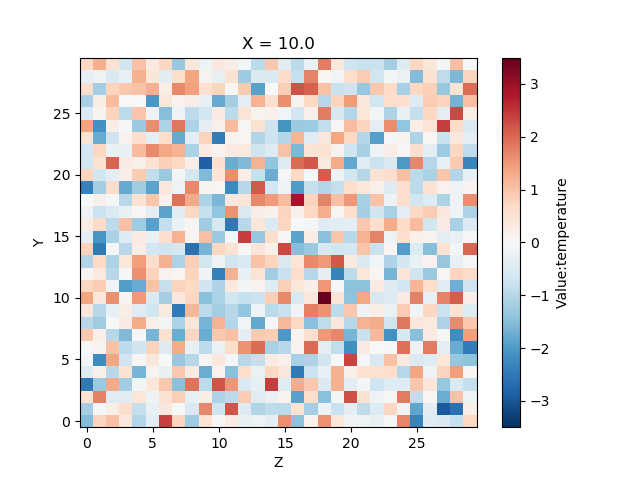


##### Example 3: 3D volume handling

```python
L = 30
d = Dataset()

# Add bin-edge axis for X
d[Coord.X] = ([Dim.X], np.arange(L+1))
# ... and normal axes for Y and Z
d[Coord.Y] = ([Dim.Y], np.arange(L))
d[Coord.Z] = ([Dim.Z], np.arange(L))

# Add data variables
d[Data.Value, "temperature"] = ([Dim.Z, Dim.Y, Dim.X], np.random.normal(size=L*L*L).reshape([L,L,L]))
d[Data.Value, "pressure"] = ([Dim.Z, Dim.Y, Dim.X], np.random.normal(size=L*L*L).reshape([L,L,L]))
# Add uncertainties, matching name implicitly links it to corresponding data
d[Data.Variance, "temperature"] = d[Data.Value, "temperature"]

# Uncertainties are propagated using grouping mechanism based on name
square = d * d

# Rebin the X axis
d = rebin(d, Variable(Coord.X, [Dim.X], np.arange(0, L+1, 2)))
# Rebin to different axis for every y
rebinned = rebin(d, Variable(Coord.X, [Dim.Y, Dim.X], np.arange(0, 2*L).reshape([L,2])))

# Do something with numpy and insert result
d[Data.Value, "dz(p)"] = ([Dim.Z, Dim.Y, Dim.X], np.gradient(d[Data.Value, "pressure"], d[Coord.Z], axis=0))

# Truncate Y and Z axes
d = Dataset(d[Dim.Y, 10:20][Dim.Z, 10:20])

# Mean along Y axis
meanY = mean(d, Dim.Y)
# Subtract from original, making use of automatic broadcasting
d -= meanY

# Extract a Z slice
d = Dataset(d[Dim.Z, 7])
```


##### Example 4: Handling spectrum data

```python
d = Dataset()

d[Coord.SpectrumNumber] = ([Dim.Spectrum], np.arange(1, 101))

# Add a (common) time-of-flight axis
d[Coord.Tof] = ([Dim.Tof], np.arange(1000))

# Add data with uncertainties
d[Data.Value, "sample1"] = ([Dim.Spectrum, Dim.Tof], np.random.poisson(size=100*1000).reshape([100, 1000]))
d[Data.Variance, "sample1"] = d[Data.Value, "sample1"]

# Create a mask and use it to extract some of the spectra
select = Variable(Coord.Mask, [Dim.Spectrum], np.isin(d[Coord.SpectrumNumber], np.arange(10, 20)))
spectra = filter(d, select)

# Direct representation of a simple instrument (more standard Mantid instrument
# representation is of course supported, this is just to demonstrate the flexibility)
steps = np.arange(-0.45, 0.46, 0.1)
x = np.tile(steps,(10,))
y = x.reshape([10,10]).transpose().flatten()
d[Coord.X] = ([Dim.Spectrum], x)
d[Coord.Y] = ([Dim.Spectrum], y)
d[Coord.Z] = ([], 10.0)

# Mask some spectra based on distance from beam center
r = np.sqrt(np.square(d[Coord.X]) + np.square(d[Coord.Y]))
d[Coord.Mask] = ([Dim.Spectrum], np.less(r, 0.2))

# Do something for each spectrum (here: apply mask)
d[Coord.Mask].data
for i, masked in enumerate(d[Coord.Mask].numpy):
    spec = d[Dim.Spectrum, i]
    if masked:
        spec[Data.Value, "sample1"] = np.zeros(1000)
        spec[Data.Variance, "sample1"] = np.zeros(1000)
```


### <a name="examples-cpp"></a>C++ example

The following is a relatively complex example of the capabilities of `Dataset`.
Apart from minor details and operations that have not been fully implemented yet, all features that are used below have been demonstrated to work in the prototype.

```cpp
// Create an empty dataset.
Dataset d;

// Add some information about the instrument. This would likely be wrapped in
// convenience functions.
// Data passed as argument, e.g., initializer_list.
d.insert<Coord::DetectorId>({Dim::Detector, 4}, {1, 2, 3, 4});
// No data passed, will be default-constructed.
d.insert<Coord::DetectorPosition>({Dim::Detector, 4});

// Add spectrum-to-detector mapping and spectrum numbers.
std::vector<std::vector<gsl::index>> grouping = {{0, 2}, {1}, {}};
d.insert<Coord::DetectorGrouping>({Dim::Spectrum, 3}, grouping);
d.insert<Coord::SpectrumNumber>({Dim::Spectrum, 3}, {1, 2, 3});

// Add time-of-flight axis ("X" in current Mantid nomenclature) which
// will be shared for all spectra.
d.insert<Coord::Tof>({Dim::Tof, 1000});
Dimensions dims({{Dim::Tof, 1000}, {Dim::Spectrum, 3}});

// Add data and uncertainties ("Y" and "E" in current Mantid nomenclature).
d.insert<Data::Value>("sample", dims);
d.insert<Data::Variance>("sample", dims);

// Add another set of data and uncertainties.
d.insert<Data::Value>("background", dims);
d.insert<Data::Variance>("background", dims);

// Add monitors as a nested dataset.
d.insert<Coord::MonitorName>({Dim::Monitor, 2}, "beam-status", "main");
d.insert<Data::Monitor>("monitor", {Dim::Monitor, 2});
// Add data to monitors. Use DatasetIndex to do lookup by name.
DatasetIndex<Coord::MonitorName> monitors(d);
// First monitor has histogram data and is pixelated.
int pixels = 10 * 10;
auto &beam_mon = d.get<Data::Monitor>()[monitors["beam-status"]];
beam_mon.insertAsEdge<Coord::Tof>("", {Dim::Tof, 101});
beam_mon.insert<Data::Value>("", {{Dim::Tof, 100}, {Dim::Spectrum}},
                             100 * pixels);
beam_mon.insert<Data::Variance>("", {{Dim::Tof, 100}, {Dim::Spectrum}},
                                100 * pixels);
// Second monitor is event-mode.
auto &main_mon = d.get<Data::Monitor>()[monitors["main"]];
// Note that there is Coord::Tof and Data::Tof, the latter is used for events.
main_mon.insert<Data::Tof>("", {Dim::Event, 238576});
main_mon.insert<Data::PulseTime>("", {Dim::Event, 238576});

// Convert monitor to histogram.
auto mon = d.get<Data::Monitor>()[monitors["main"]];
// Bin events using axis from d.
auto mon_hist = binEvents(mon, d.at<Coord::Tof>());
// Merge histogram monitor data into monitor. Note that we can keep the
// events if we want.
mon.merge(mon_hist);

// Normalize "sample" and "background" to monitor. Note that the variables
// in monitor do not have a name so it will affect all data variables with a
// matching tag.
d /= d.get<Data::Monitor>()[monitors["main"]];

// Build equivalent to Mantid's WorkspaceSingleValue.
Dataset offset;
offset.insert<Data::Value>("sample", {}, {1.0});
offset.insert<Data::Variance>("sample", {}, {0.1});
// Note the use of name "sample" such that offset affects sample, not
// other `Data` variables such as "background".
d += offset;

// Subtract the background. To get around name matching we extract data for
// subtraction, removing it from the dataset to avoid failure in operator-.
d.merge(d.extract("sample") - d.extract("background"));

// Copy the dataset. All variables use copy-on-write, so this is cheap.
auto spinUp(d);
spinUp.insert<Coord::Polarization>({}, Spin::Up);
auto spinDown(d);
spinDown.insert<Coord::Polarization>({}, Spin::Down);

// Combine data for spin-up and spin-down in same dataset, polarization is
// an extra dimension.
auto combined = concatenate(Dim::Polarization, spinUp, spinDown);

// Do a temperature scan, adding a new temperature dimension to the dataset.
Dataset tempEdges.insertAsEdge<Coord::Temperature>({Dim::Temperature, 6},
                                                   {273.0, 200.0, 100.0, 10.0,
                                                    4.2, 4.1});
// Empty dataset for accumulation.
Dataset scan;
auto dataPoint(combined);
for (const auto temperature : DatasetView<Bin<Coord::Temperature>>(tempEdges)) {
  dataPoint.get<Data::Value>("sample - background")[0] =
      exp(-0.001 * temperature.center());
  // Note that concatenate will collapse dimensions of a variable if the
  // variable is constant. For example, Coord::Tof is the same for all data
  // points so it will *not* have Dim::Temperature in the result.
  scan = concatenate(Dim::Temperature, scan, dataPoint);
}
// Merge temperature axis.
scan.merge(tempEdges);

// Convert units or dimension. Note that for units of independent variables
// a unit change implies a change in the dimension (label). The exact API
// for this has not been designed yet.
scan = convert(scan, Dim::Tof, Dim::Wavelength);

// Extract a single wavelength slice.
auto lambdaSlice = slice(scan, Dim::Wavelength, 10.5);

// Compute the spin difference.
DatasetIndex<Coord::Polarization> spin(lambdaSlice);
// If we want to subtract slices we need to remove mismatching coordinates
// first, otherwise binary operations will fail.
lambdaSlice.erase<Coord::Polarization>();
lambdaSlice = slice(lambdaSlice, Dim::Polarization, spin[Spin::Up]) -
              slice(lambdaSlice, Dim::Polarization, spin[Spin::Down]);

// Create a nested DatasetView, for "zip"-style iteration
// Define an abbreviation for a nested view. For convenience, frequently
// used variants could be provided as built-ins. Note the `Bin` wrapper,
// which is used for joint iteration of bin-edge variables and other
// variables.
using Histogram = DatasetView<Bin<Coord::Temperature>, const Data::Value,
                              const Data::StdDev>;
// We specify Dim::Temperature when creating the view, indicating that the
// (outer) view will not iterate that dimension. This implies that it will
// be the (only) dimension of the nested views.
DatasetView<Histogram, const Coord::SpectrumNumber>
    view(lambdaSlice, "sample - background", {Dim::Temperature});

for (const auto &tempDependence : view) {
  // Items in view have named getters, alternatively
  // get<Coord::SpectrumNumber>() can be used.
  printf("Plotting spectrum %d\n", tempDependence.spectrumNumber());
  // Plot the data.
  mantid::matplotlib::plot(tempDependence.get<Histogram>());
  // The view we are passing to `plot` can be operated on as follows.
  for (const auto bin : tempDependence.get<Histogram>()) {
    // Note that we can read left, right, and center of the bin, even though
    // the underlying data is storing the edges.
    mantid::matplotlib::drawBox(bin.left(), bin.right(), bin.value());
    // Note that we can read the standard deviation, even though the
    // underlying data is stored as variance.
    mantid::matplotlib::drawErrorBar(bin.center(), bin.value(), bin.stdDev());
  }
}
```


## <a name="design-details"></a>Design details


### <a name="design-details-dependencies"></a>Dependencies

- `boost::units` for unit handling.
- `boost::container` for `small_vector`, which is used as an optimization in a couple of places.
- `boost::mpl` to help with some meta programming.
- `Eigen` for vectors and rotations, in particular for detector positions.
- `gsl` is used for `gsl::index` and `gsl::span`.
  This could easily be replaced by a stand alone implementation, in particular since `span` is part of C++20.
- `range-v3` has been used for implementing some multi-column sort operations but replacing it by a stand-alone implementation should be no trouble.
- GoogleTest for unit testing.
- GoogleBenchmark for benchmarking.

The prototype has been implemented using C++14, and this is sufficient.
Nevertheless, having C++17 available would be an advantage, particularly since a moderate amount of template-meta programming is required.
Given the long time scale, it could be expected that the Mantid project is ready to move to C++17 by the time `Dataset` might be included in the main repository.

Note that `Dataset` or rather `Variable` will be able to hold data from libraries that are *not* dependencies of this library.
It is sufficient to forward-declare types when adding a tag for such a variable.
*Example:
We can store `API::Run` in `Dataset`, but the dataset library does not need to depend on `Mantid::API`.*

It is currently unclear whether this library should be kept as a separate repository or be included as a new module in the Mantid repository.
- The advantage of inclusion is the automatic use of the build server and deployment infrastructure.
- The disadvantage is a potential coupling of versioning, see [API stability](#design-details-api-stability).

If included in the Mantid repository, stand-alone packages should be provided as a light-weight alternative to downloading the full Mantid package.


### <a name="design-details-unit-tests"></a>Unit tests

The library is intended as a low-level building block and the mixed-multi-dimensional aspected lead to many corner cases.
A comprehensive and maintainable suite of unit tests is thus essential.


### <a name="design-details-benchmarks"></a>Benchmarks

Given the intention of being a low-level building block for everything else, ensuring good performance and preventing performance regression is thus essential.
A suite of benchmarks is to be maintained and monitored for changes.


### <a name="design-details-sanitizers"></a>Sanitizers

Static analysis and sanitization runs should be performed and verified automatically.
Most importantly, AddressSanitizer should be used to strictly monitor for memory corruption bugs.


### <a name="design-details-code-review"></a>Code review

The same review/approval system for pull request as in Mantid should be adopted.
However, given the scope of the project, we should require *two full reviews*, i.e., the gatekeeper should also do a thorough review, in addition to the first reviewer.


### <a name="design-details-documentation"></a>Documentation

Documentation is required for several cases:
- Library (developer) documentation.
- C++ API (user) documentation.
- Python API (user) documentation.
- Python usage examples beyond simple API documentation, e.g., how to represent complex data structures such as a `DataObjects::Workspace2D` as a `Dataset`.


### <a name="design-details-scope-and-extension"></a>Scope and extension

The design described here is seen as a nearly complete description of the scope of the dataset library.
Extending the functionally should be avoided and should happen only after careful consideration.
In particular, anything that is *more* specific than already supported should not be made part of this library, but instead be placed in another library that depends on this library.
- Actually `convert` to convert units is pretty specific as it needs to connect instrument information to data.
  Is having it as part of this lowest-level library the right choice?

There are some cases which are likely to lead to additions to the dataset library:
- Initially we will not have covered all required cases with tags for `Dim` and variable tags for `Coord` and `Data`.
  In particular, we need a new `Coord` for every unit that we support.
- As a consequence the unit handling will also need to be extended.


### <a name="design-details-api-stability"></a>API stability

The C++ version as well as the Python exports are meant as a low level building block for other parts of the project, in addition to direct use in scripts by users.
Therefore we need to ensure that the API is reasonably stable.
At the same time, we will struggle with things that do not work out early on as imagined right now and will need to change the API.
- The API is considered unstable and can change without notice until the library version has reached v1.0.
- With v1.0 onwards the Python API should only change with major releases and a proper deprecation cycle.
- The C++ API should ideally follow the same rules as the Python API.
  However, since most or all C++ code using the API should be under our control, the API may be updated in a less restrictive way if there is a good reason.

The implication is that this library would probably require versioning independent of Mantid itself.


### <a name="design-details-naming"></a>Naming

#### Components of the library are part of namespace `dataset`

##### Rationale

Mantid currently uses upper-case namespace names.
However, this can lead to artificial and unintuitive namespace or class names.
Instead, namespaces like `dataset` should be lower-case, as opposed to types which are upper-case.
We then have, e.g., `dataset::Dataset`.
This also matches the Python convention where module names are typically lower-case, thus reducing the differences between the C++ and Python APIs.

#### The Python module name is `dataset`

##### Rationale

This is a corollary from the namespace name.

#### The top level namespace and module is `mantid`

##### Rationale

Currently we have `namespace Mantid` in C++ while the Python module is `mantid`.
Changing the namespace name would improve consistency.
Furthermore, this would reduce naming clashes between existing and new code.

##### Questions

Does this make sense?
Where to we put additional functionality?
Sibling or children of `dataset`?
Consider `class Dataset` itself and two hypothetical modules with *additional* functionality that is not part of this library.
Our options would include:
1. `mantid::dataset::Dataset`, `mantid::dataset::algorithm`, `mantid::dataset::io`.
1. `mantid::dataset::Dataset`, `mantid::algorithm`, `mantid::io`.
1. `mantid::dataset::core::Dataset`, `mantid::dataset::algorithm`, `mantid::dataset::io`.


### <a name="design-details-attributes"></a>Attributes

##### Context

Variables grouped into coordinates and data cover almost all relevant cases, both in terms of what information needs to be stored as well as the behavior under operations, matching for coordinates and transformation for data.
However, there is one exception:
Metadata seems to fall in neither of the two categories.
In the case of Mantid almost all metadata is contained in the `API::Run` object.
The current behavior is to carry the metadata through most operations unchanged, with a few exceptions like `Algorithms::Plus` which merge the metadata.

`xarray` handles metadata by supporting arbitrary *attributes* for `xarray.Dataset`.
Most `xarray` operations drop attributes, unless explicitly asked to keep them using `keep_attrs`.
See also the [xarray approach to metadata](http://xarray.pydata.org/en/stable/faq.html#what-is-your-approach-to-metadata).
There are also several [ongoing](https://github.com/pydata/xarray/issues/988) [discussions](https://github.com/pydata/xarray/issues/1614) in the `xarray` community and developer team.
Many groups seem to be looking for solutions to similar problems.

##### Conclusion

- `Dataset` should support a third class of variables, attributes, with tag `Attr` complementing the `Coord` and `Data` variables discussed previously.
- All operations propagate attributes unchanged, without matching them.
- Support special behavior for certain operations, e.g., merging attributes in `operator+`.

See also a [working example](../test/Run_test.cpp) that shows automatic matching, merging, and propagation of meta data purely based on `Dataset`.

##### Rationale

- This is contrary to what `xarray` does, but it seems to be more in line with the needs for Mantid and also how Mantid behaves currently.
- `xarray` provides a `compat` option to require matching attributes.
  This may be useful if units are stored as attributes (`xarray` has no explicit unit support).
  In our case we directly support units, so matching attributes in operations is less useful.

##### Details

- `Attr::ExperimentLog`, replacing/storing `API::Run` is the only relevant example for now.
- We see no need to provide an equivalent to `xarray`'s `keep_attrs`.
  If attributes should be dropped we can do so explicitly in a separate operation.


### <a name="design-details-copy-on-write-mechanism"></a>Copy-on-write mechanism

##### Context

From a high-level point of view there are two extremes that can be adopted when copying a `dict`-like object like `Dataset`:
1. A copy of `Dataset` will always make a copy of all variables.
2. A copy of `Dataset` will not make a copy of variables. 
   The underlying data buffers will remain shared and modifying the copy will implicitly modify the original.

The big advantage of 1.) is that it is easy to reason about and most relevant operations such as modifying non-overlapping chunks are automatically thread safe.
The big disadvantage is the cost of copying and the size overhead in case only a subset of variables is modified.

The big advantage of 2.) is that there is basically no overhead to copying `Dataset` and modifying only a subset of variables will cause no memory overhead.
This is how Python operates, e.g., for a `dict` of array-like objects.
`numpy`, `pandas`, and `xarray` also adopt these semantics.
The disadvantage is that operations cannot be done in-place without risking breaking all other instances.
In-place operations would furthermore not be thread-safe in many cases.

A compromise between the two is the copy-on-write mechanism that has since long been adopted in Mantid, e.g., in `DataObjects::Workspace2D` for the histogram data and for `Beamline::DetectorInfo`.
Qt uses a slightly different implementation referred to as [implicit sharing](http://doc.qt.io/qt-5/implicit-sharing.html) for many of their basic data types.
This combines the advantages of easy-to-reason-about value semantics with no-overhead copying or partial modification.

The cost is *invalidation of all iterators, references, or views* to the underlying data if *any* non-`const` method is called or if a copy is made.
This is also made explicit in the [corresponding Qt](http://doc.qt.io/qt-5/containers.html#the-iterator-classes) [documentation](http://doc.qt.io/qt-5/containers.html#implicit-sharing-iterator-problem).
The effect is most visible in multi-threaded environments, but can be demonstrated even without:

```cpp
#include "MantidKernel/cow_ptr.h"

Kernel::cow_ptr<std::vector<double>> vec;
vec.access().resize(1000);
auto copy(vec);

auto const_it = vec->begin();
vec.access()[0] = 1.0;
// const_it is now pointing to data owned exclusively by copy.

copy.reset(); // This could be DeleteWorkspace in another (GUI) thread.
// const_it is now pointing to free'ed memory.
```

Note that this trap is absolutely not obvious since only the middle section of the above block would typically be part of the local source code.
For example, many algorithms support `OutputWorkspace == InputWorkspace` and may call something like
```cpp
// This is illegal, do not do this, unless you verified that outputWS != inputWS.
outputWS.mutableY(0) = inputWS.y(0);
```

If `outputWS == inputWS` and the reference count for the Y data is not 1 then `inputWS.y(0)` references data that is now owned by other workspace instances or by other histograms in the same workspace.
That is, it can be arbitrarily modified or even get deallocated.

Note that assignment (`operator=`) [is not a sequence point in C++](https://en.cppreference.com/w/cpp/language/eval_order), i.e., this problem does indeed occur even if neither the LHS nor the RHS in above example is explicitly stored as a reference.


##### Conclusion and rationale

- Neither of the extreme cases 1.) or 2.) seems to be a viable alternative.
- Use a copy-on-write mechanism that is hidden in the API and simply handled internally in `Variable`:
  A copy-on-write pointer holds a `VariableConcept`.
  To maintain sharing we only require code to be `const`-correct.
  *Note: In Python there is no `const` concept. We can default to read-only access, which is quite natural for the functional non-in-place operation of typical Python code. In combination with a `__setitem__` this should cover most cases.*
  - Do not expose the copy-on-write mechanism on the API.
    For the interface of `API::MatrixWorkspace` (and in connection to that `HistogramData::Histogram`) this has led to an interface that is too complicated, with different API functions for read-only access, write-access, and access for sharing.
- Documentation as well as developer and user training needs to be *very* clear about the implication for iterators, references, and other forms of views.
  In particular we have, very similar to what the Qt documentation implies:
  1. Non-`const` methods of `Variable` (and by extension some of those in `Dataset`) invalidate all iterators.
     Furthermore, *copying* `Variable` or `Dataset` also invalidates all iterators.
  2. Non-`const` methods of `Dataset` and `Variable` are not thread-safe.
     Exception: Writing to different variables in `Dataset` *is* thread-safe.
  3. Writing to different parts of the data buffer in a variable *is* thread-safe.
     Note that 2.) implies that *getting* the reference to the data buffer is *not* thread-safe.

  These limitations may sound bad (even though we are already living with them right now), but if we get the API and other low-level functionality right we can potentially eliminate many cases where developers or users would come across these issues in their daily work.
  One example could be to implement most functionality in a "functional" way, i.e., as functions that return a new `Dataset`.
  In-place operations would be implemented by passing arguments by-value (or as rvalue references).
  This would prevent most issues similar to the example with `outputWS == inputWS` discussed above.
- `Kernel::cow_ptr::access()` is made thread-safe via a mutex.
  This may seem nice, but it is also confusing since "*write* concurrent with *write*" is safe but "*read* concurrent with *write*" is *not*.
  We should probably go with the Qt way here, where `QSharedDataPointer::detach()` is not thread-safe.
  This would also eliminate the `std::mutex` from `cow_ptr` which may be relevant for using `Dataset` for small objects like event lists.

See also [Slicing](#design-details-slicing).

##### Alternatives

As a possible alternative we can make coordinate variables in `Dataset` shared but immutable and always copy data variables.
Since coordinate variables change infrequently the immutability is not a huge drawback but reduces the copy overhead somewhat.
Data changes more frequently so copying it is probably feasible.
However, this certainly has negative effects on memory usage and performance.
Furthermore it would significantly reduce the flexibility gained with `Dataset` since suddenly having datasets with many variables will become a burden instead of an opportunity.


### <a name="design-details-uncertainties-are-stored-as-variances"></a>Uncertainties are stored as variances, not standard deviations

##### Rationale

Mantid currently stores uncertainties as standard deviation (except for `DataObjects::MDHistoWorkspace`).
However, most computations require the variance for propagation of uncertainties.
To this end it is often squared in place (breaking assumptions about, e.g., `HistogramData::Histogram` and `DataObjects::Workspace2D`, and subsequently converted back to standard deviation by taking the square root.
This also adds a little computational overhead.
Having a clear and well defined strategy will reduce the risk of confusion.

##### Implementation

The go-to tag for storing uncertainties will be `Data::Variance`.
`Data::StdDev` will exist, but is for *access* only, i.e., attempting to create a `Variable` with that tag should fail.
Instead `Data::StdDev` can by used in combination with `DatasetView` to *read* the standard deviations if required, e.g., for visualization purposes.
If it turns out to be useful it would also be possible to provide setters --- as opposed to a simple assignment which is possible if the actual underlying data is referenced --- for standard deviation using `DatasetView` .


### <a name="design-details-distribution-histogram-distinguised-by-unit"></a>"Distributions" and "histogram data" are distinguished by their unit

##### Rationale

Currently `API::MatrixWorkspace` (and by extension `HistogramData::Histogram`) keep a flag indicating whether data in a histogram has been divided by its bin width.
A considerable number of algorithms are checking this manually, branching to different code sections.
`HistogramData::Histogram` attempted to solve this by introducing getters like `Histogram::counts()` and `Histogram::frequencies()`.
However, it seems to be useful only in a rather limited number of places, whereas it adds a significant amount of complication to the API.
The flag adds complication and should thus be removed.

##### Implementation

This will require having a unit for "counts", i.e., we cannot simply use "dimensionless".
We need to establish whether it is possible to write clean client code based on the unit-driven mechanism.
Apart from that there should not be any major implementation difficulties.

Example:

- Count data has `Unit::Counts`.
  Note that this is not the same as `Unit::Dimensionless`.
- Anything with a unit `Unit::Count/<unit of x axis>` is "frequencies" (aka "distribution"), as is probably also any other unit `<some unit>/<unit of x axis>` (I am not sure the latter actually exists in practice?).
- I think we can also have any other unit `<some unit>`, which in Mantid right now would probably by labeled "distribution" (but I am not sure that is correct?).

A vanadium normalization would compute:

```
(counts/angstrom) / ((vanadium_)counts/angstrom) = dimensionless
```

The division by the bin width is "undone" by the normalization.
See also the related problem [as highlighted recently](https://github.com/mantidproject/documents/blob/fix-divide-distribution/Design/DistributionsAndDimensionlessData.md).
Would this suggestion actually solve the issue?


### <a name="design-details-no-progress-reporting-no-cancellation"></a>No progress reporting and no cancellation

##### Rationale

- Most operations are simple and thus fast.
- Cancellation and progress reporting can be implemented in higher-level algorithms that *use* `Dataset`.
  For example, a workflow algorithm that calls many "child" algorithms can provide interruption points after each child call.
- Cancellation leads to undefined side effects for in-place operation, i.e., it breaks data.
  Cancellation for non-in-place operation would be possible.
- Adds complexity and complicates the interface.
- `numpy` operations cannot be cancelled and do not report progress.

##### Footnotes

If it turns out to be required after all, a callback-based system such as VTK's would be an option.

- See, e.g., this [example in Mantid](https://github.com/mantidproject/mantid/blob/21b138884c35d8daaac103c5d7f5c890f6a50c56/qt/paraview_ext/VatesAlgorithms/src/SaveMDWorkspaceToVTKImpl.cpp#L231)
- In any case, this is probably possible only for `Dataset` operation, with interruption points between processing individual variables:
  Processing each variable is typically mainly only due to memory allocation, which cannot be interrupted since it is a single large block, contrary to the individual histograms in Mantid.


### <a name="design-details-no-length-variation"></a>No support for histograms with varying length in a contiguous multidimensional block

##### Rationale

This has not been supported in `DataObjects::Workspace2D` for 10 years, until a very recent change, i.e., it does not appear to be strictly necessary since it can be solved in other ways (see below).
Support has been considered and prototyped, however there are two strong reasons it is not part of the final design:
- Significant complication of implementation for all operations, leading to larger initial development cost and more difficult long-term maintenance.
- Negatively affects the performance of iteration via `DatasetView`, *even if the length does not vary*.

##### Alternative solutions and workarounds

There are several options to support varied-length data:

1. Use `NaN` padding. This is what also `xarray` does, and is the strategy adopted most in Mantid.
   There are several ways to make this more convenient to use than the current system:
   - Be very clear about the meaning of `NaN` in coordinate variables.
   - Use masking or region-of-interest variables for clarity, e.g., `Coord::Mask` or `Coord::ROI`, in addition to the `NaN` values.
   - Implement helper views that provide a view restricted to the valid region of data.
     This can be done using normal slice views (like the `numpy` slicing notation), but a convenience wrapper that finds the valid region on its own would be more useful.

   A similar solution is provided also by `numpy` with its [masked arrays](https://docs.scipy.org/doc/numpy/reference/maskedarray.html)

1. It is possible to store a variable holding datasets in a dataset, e.g., 1-dimensions histograms.
   The result would be very similar to our current `DataObjects::Workspace2D`.
   In general we should discourage doing this since most of the other functionality we provide would not work nicely with such as nested dataset.
   However, if a varying histogram length is essential for some purpose it is absolutely possible.
   Even mixing histograms and event lists would be possible.

A look into [Apache Arrow](https://arrow.apache.org/) may also provide further ideas for implementation of handling missing data.


### <a name="design-details-threading"></a>Operations are threaded using OpenMP

##### Rationale

Threading using OpenMP in a fork-join style manner is not the most efficient one.
As part of the prototyping process we considered other solutions, in particular [dask](https://dask.org/).
Dask could solve many problems such as overcoming the limitations of the fork-join approach as providing a unified solution for threading and multi-process parallelisation such as MPI.
However, the prototyping experience indicated that it is not performant enough to completely replace threading for our typical workloads.
For that reason, and for maximum simplicity, optimal performance requires multi-threading.

##### Implementation

In most cases a simple `#pragma omp parallel for` could do the job.
We should probably limit the thread count depending on the size of data and the operation in question.
For small data the threading overhead may be larger than the gains.
For large data, many cases such as `operator+` are heavily limited by memory bandwidth and using more cores than necessary for reaching the peak bandwidth would be wasteful.


### <a name="design-details-no-magic"></a>No magic

##### Rationale

Many algorithms in Mantid do "magic" under the hood:
- Convert inputs if required. *Example: Conversion from point data in `Algorithms::ConvertUnits` and `Algorithms::Rebin`.*
- Tolerate partially bad input data. *Example: Replacing special values in `Algorithms::SumSpectra`.*
- Support doing two different things that are actually different. *Example: `Algorithms::Rebin` can rebin histogram data, bin event data, or set new bin edges in a workspace.*
- Combine multiple processing steps. *Examples: Aligning bins in `Algorithms::ConvertUnits`. Loading and saving calibration files in `Algorithms::MaskDetectorsIf`.*

Support for such features complicates the implementation and makes reasoning about code harder.
It should therefore not be done in this library.
- Operations should simply fail as early as possible.
- Inputs are required to be cleaned up and converted to the correct format explicitly.
- Processing steps should be kept as separate operations.

##### Note

There is nothing wrong with "magic" in higher-level operations.
High level algorithms that simply work no matter what is thrown at them are likely still a requirement.
We are merely banning it from *this* library, i.e., the lowest-level building block.


### <a name="design-details-no-logging"></a>No logging

##### Rationale

As a corollary from the "no magic" strategy above, there will be very few occasions that require log messages.
Logging can be implemented in higher-level algorithms, or potentially in some Python wrappers.
Adding logging functionality would increase complexity and add extra dependencies.

##### Alternatives

- If required we could log to `stdout` using `std::cout`, which can be redirected and filtered.
- It would be possible to provide an empty wrapper for logging, which avoids introducing dependencies.
  If a client requires logging they can implement the wrapper and forward to the logging system of their choice.
  This is basically what also Qt provides by [installing as message handler](http://doc.qt.io/qt-5/qtglobal.html#qInstallMessageHandler).


### <a name="design-details-exception-safety"></a>Operations have strong exception guarantee or clear data if only a basic exception guarantee can be given

##### Rationale

For performance reasons operations can be (and are in practice) applied in-place.
If an exception is thrown it can happen that data is partially modified and thus in an unknown state.
It is impossible for client code to tell if data has been corrupted, unless there is a well defined exception safety guarantee in combination with flagging of bad data.
The user thus continue working with the bad data, with unknown consequences.

##### Implementation

Wherever possible, operations should provide a strong exception guarantee, i.e., even for in-place operations there should be no risk of unknowingly corrupting data.
This simply boils down to performing any checks up-front, before data is modified.
For operations that cannot give a strong guarantee we need to avoid accidental use of corrupted data.
The safest and simplest way to do so is to completely clear datasets that may have been corrupted.

The exception safety guarantee of each operation is to be documented.


### <a name="design-details-no-processing-history"></a>No processing history, for the time being

##### Rationale

All Mantid algorithms are recorded in the workspace processing history, and this is one of the most important features of Mantid.
It is currently not clear how this is best handled for `Dataset`.
If the operations for datasets end up getting wrapped in algorithms there is no need to direct history handling in `Dataset`.
If this is not the case it would be very desirable to have this feature, and according to very basic prototyping it could simply be handled as an additional variable in the dataset.
There would be some complications related to having a history without `API::AnalysisDataService` so there is some effort connected to coming up with an actual solution.
Overall however, it should have no influence on the `Dataset` design, i.e., it seems safe to postpone a decision until we have a clearer understanding of how `Dataset` will be used in practice and how it will get integrated in the current Mantid ecosystem.


### <a name="design-details-floating-point-precision-compile-time"></a>Floating-point precision can be set at compile time

##### Rationale

Mantid currently uses double precision for time-of-flight, counts, and values derived from the former two.
Using single precision could give a performance improvement of the order of 2x.
Apart from global accumulation (which could be done in double precision) there appear to be no (or few) operations where double precision would be required.
Taking the step to *always* use single precision for those variables would probably be too large a risk.

##### Implementation

- Define the precision of relevant variables (`Data::Value`, `Data::Variance`, `Data::Tof`, `Coord::Tof`, ...) at compile time.
- Run all tests for both the single- and the double-precision versions of the library.
- Provide two library versions, probably with a default.
  For example, we could initially default to using the double-precision library, using the single-precision version only on demand for applications with high performance demands after the particular workflow has been validated to be correct in single precision.
  At a later point, in case we have convinced ourselves that the single-precision version is always sufficient, the default could be changed.

It is not entirely clear how much development overhead this would cause for code depending on this library.
More code is likely to require templating for the precision (`double` and `single`).
However, the development cost for this library itself would be rather minor, so there is very little risk involved in supporting it from the beginning.


### <a name="design-details-performance-opportunities"></a>Performance opportunities

For very basic in-place operations we can hardly improve upon what is provided in Mantid.
For example, `operator+=` is bound by memory bandwidth.

Nevertheless, there is a series of things we can do to improve performance in other cases.
We do not suggest implementing this initially, but the prototype has been used to show that these are feasible options that give us opportunities for improvement in the future:

- Use custom allocators or memory pools to overcome allocation cost.
- Use object pools to overcome allocation/initialization cost.
- Process data in small chunks that fit into cache to overcome the memory bandwidth limit.


### <a name="design-details-slicing"></a>Slicing

We would like to support slicing as in `numpy` and `xarray`, e.g., `array[2:4,10:20, :]` in the case of slicing `Variable` (or the equivalent with named dimensions in the case of slicing `Dataset`, as supported in `xarray`).
In both `numpy` and `xarray` the returned object is a view, i.e., data is not extracted.

The ownership and copying discussion in the section [Copy-on-write mechanism](#design-details-copy-on-write-mechanism) is related to such slice-views and implies:
- Any iterator obtained from a view is invalidated if any non-`const` method on *any other view* to the same `Variable` is called.
  - The view itself can stay valid since it references the variable, not its data.
- Contrary to the `numpy` behavior, if the owning `Variable` goes out of scope all views should probably become invalid.
  To support views that stay valid we would need to wrap all variables in `Dataset` into a `shared_ptr` and the benefit does not seem to justify this additional complexity at this point.


### <a name="design-details-supporting-libraries"></a>Supporting libraries

The core `Dataset` library is intended to be small and generic.
More specific but very useful functionality would be provided in supporting libraries.
Potential examples include:

- Serialization and I/O.
- Helpers for creating common "standard" datasets, e.g., equivalents to `Workspace2D` or `EventWorkspace`.
- Helpers for adding an instrument to a dataset.
- Conversions between workspaces and datasets.
- Validators.

There will be many more than these, but they will generally added if needed instead of deciding up-front.


## <a name="implementation"></a>Implementation


### <a name="implementation-path"></a>Implementation path

A high level overview of an implementation path is given in the figure below.
- Time flows roughly from top to bottom.
- The size of blocks is often *not* an indication of the required effort.
  See the section on [Effort](#implementation-effort) for the required resources.
- Outcomes are shown encircled.
- Red lines indicate completion major outcomes/milestones grouped into phases.
  - `Phase 2+WB` (`Workbench` integration) is flexible and relatively disconnected.
    It may be done sooner or later in the second phase, or even after.
- In `Phase 2+X` the precise plan is deliberately unspecified, i.e., we list various options.
  We firmly believe that it is impossible to make a qualified decision on this part before we have at least completed `Phase 1` and parts of `Phase 2`.
  At this point it is entirely unclear how and how quickly `Dataset` would be adopted, so the decision is postponed.
  Note that this is possible because everything in `Phase 1`, `Phase 2`, and even `Phase 2+WB` is independent of the choice for completing (or not completing) the rollout.

A more detailed discussion of the individual tasks and components is given after the diagram.

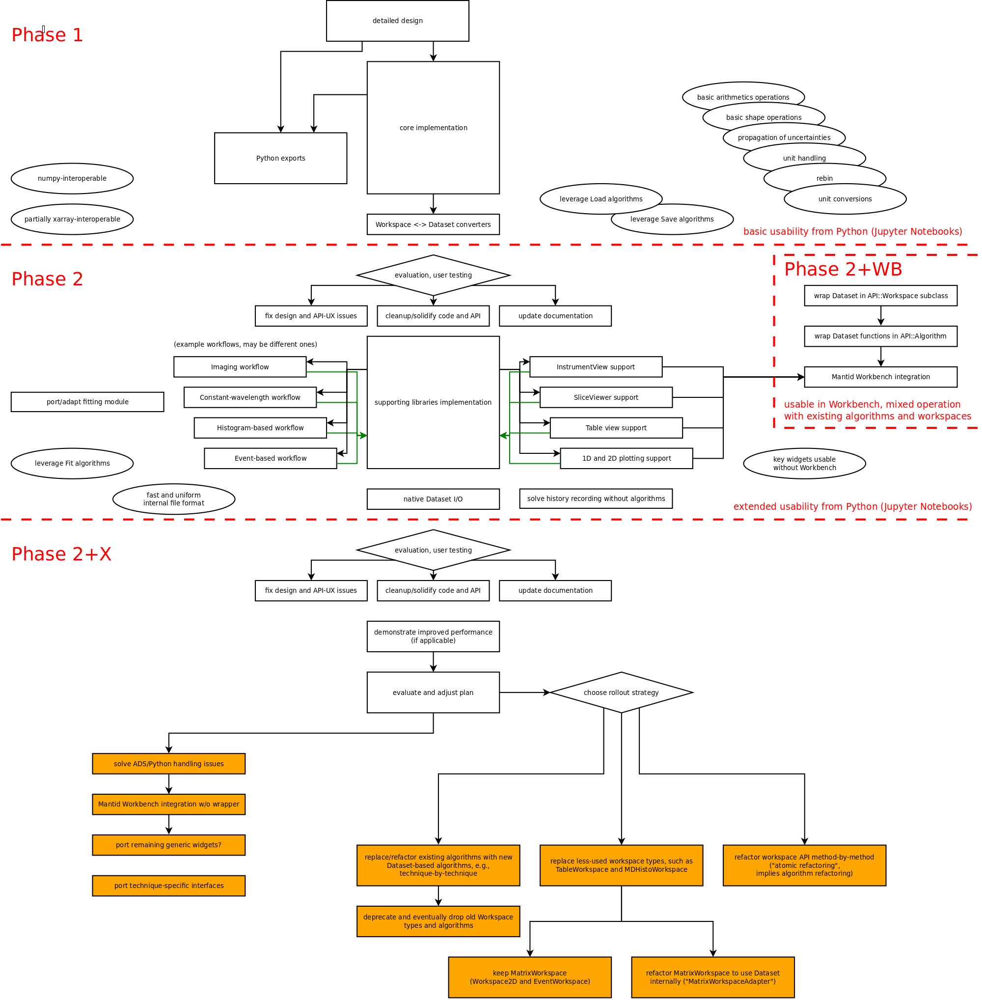


#### <a name="implementation-phase-1"></a>Phase 1

- Detailed API design.
- Core implementation.
  - `Dataset`, `Variable`, assortment of views.
  - Units.
  - Various helpers.
  - Basic operations.
- Python exports.
  This is probably relatively simple since almost everything is just a 1:1 export of a corresponding C++ function or method.
  - `numpy` interoperability is almost out of the box.
  - `xarray` interoperability would likely provided via a zero-copy wrapper, with certain exceptions (event data, bin edges converted to bin centers).
    This will also immediately give access to 1D and 2D plotting via `matplotlib`, see [plotting in xarray](http://xarray.pydata.org/en/stable/plotting.html).
    Higher-dimensional visualization in shape of, e.g., a simplified slice viewer is also available via other libraries compatible with `xarray`, e.g., [HoloViews](http://holoviews.org/) or [hvplot](https://hvplot.pyviz.org/user_guide/Gridded_Data.html).
- Converters from `Workspace2D` and `EventWorkspace` will support testing with real data and early adoption.


#### <a name="implementation-phase-2"></a>Phase 2

- More-custom visualization:
  - Support `Dataset` natively in `InstrumentView`.
  - Support in `SliceViewer`.
  - Provide a table viewer.
  - Support 1D and 2D plotting a `Dataset` natively in the `matplotlib` wrappers and widgets that are part of the new `Workbench`.
- Implement realistic workflows.
  This servers several purposes:
  - Drive the implementation of supporting libraries on top of the generic core functionality.
  - Weed out issues with the API, bugs in the implementation, and performance issues.
  - Provide real-life examples that demonstrate the power of `Dataset` in actual workflows.
- Port/adapt the Mantid fitting module (`CuverFitting`).
  - Fitting is an essential part of Mantid and must be supported rather sooner than later.
    The module is currently coupled to the current workspace APIs and needs to be refactored to make it usable without making use of converters.
- Native `Dataset` I/O.
  - Initially this would mainly be for saving processed data (equivalent to `SaveNexusProcessed`).
  - Medium-term we will want to provide native support for directly loading event-NeXus files, instead of using `LoadEventNexus` with a subsequent conversion step.
  - If we support saving `Dataset`, we must at this point consider how to handle recording of history.
    Due to a more Python-based workflow with potentially a lot of use of `numpy` we cannot realistically hope that tracking algorithm execution in the current way is giving sufficient coverage of the actual history of data.
    - Can we somehow save the full Python script?
    - If we run in the GUI, can we just copy the executed Python code into a generic tracking-helper algorithm and add that to the history?
      Maybe this is possible even without the GUI if we somehow hook into the interpreter?


#### <a name="implementation-phase-2-wb"></a>Phase 2+WB

- Implement a thin wrapper of `Dataset`, inheriting `API::Workspace`.
  - Named `DataObjects::DatasetWorkspace`?
  - Might not even forward methods, just provide access to held dataset.
  - The base class provides `AnalysisDataService` (ADS) support, i.e., `DatasetWorkspace` can be shown in the workspace list widget.
  - The base class Provides processing history.
  - Using `DatasetWorkspace` in Python will be as broken as for all other workspaces.
- Wrap functions for working with `Dataset` as new algorithms.
  - Inherit `API::Algorithm` as usual.
  - Will automatically show up in history of `DatasetWorkspace`.
  - To avoid confusion and name clashes all algorithms for `DatasetWorkspace` are prefixed with `dataset.`, i.e., the newly added algorithms are part of a new namespace.
    - Examples: `dataset.Plus`, `dataset.Rebin`.
    - If there are concerns about confusion we can provide the option to hide these algorithms from the algorithm list.
    - This will be no more confusing than the current distinction between "normal" algorithms and "MD" algorithms.
- Provide algorithms for inserting a dataset into and extracting a dataset from the ADS.
  - Can leverage the power of Python working directly with `Dataset`.
  - Insert into the ADS wrapped into `DatasetWorkspace`, passing ownership to the ADS if GUI interaction is required.
  - Extract from ADS, passing ownership back to Python to return to pythonic operation.

It should be emphasised that we do *not* intend to use `DatasetWorkspace` for everything.
This is only meant for GUI integration in the way we are used to it.
In many cases it will be advantageous to use `Dataset` directly due to the higher flexibility.


#### <a name="implementation-phase-2-x"></a>Phase 2+X

After completion of `Phase 2` and `Phase 2+WB` there will be a series of things that is required to increase the adoption of `Dataset`.
An incomplete list of potential requirements is:

- Improved performance to motivate transition.
- Ported or newly implemented technique-specific or instrument-specific algorithms and workflow algorithms.
- Support in more interfaces for visualization.
- Support in more technique specific interfaces.

As discussed earlier this will be done in an agile manner since there are no benefits to defining a precise plan or strategy now.

Note that this list does deliberately not include refactoring all existing workspace types or all existing algorithms.
It is certainly possible that refactoring is what we will want to do, but the connected effort would be massive and the benefits may be limited (on top of the downside of introducing many bugs during refactoring).
That is, we would need very good reasons to do so.
A better option may be to simple let `Dataset` and workspaces coexist with their respective algorithms.
*Note:
It has been criticised that this would mean we have two types of workspaces and algorithms that are not compatible.
However, this is not a valid argument since we already have this situation right now, e.g., with `MDWorkspace` and `MatrixWorkspace` and the respective algorithms such as `PlusMD` and `Plus`.*

##### Random notes on various rollout options

1. In the long run it would be nice if we could use `Dataset` in the GUI without a wrapping `DatasetWorkspace` as decribed in `Phase 2+WB`.
   However, `Dataset` must remain a valid Python object, i.e., the issues with the Python interface for current workspaces must not be reintroduced for `Dataset` at this point.
   The solution for providing workspace-list integration is not clear, but there are probably a couple of options, e.g., based on introspection.
   For example, [Spyder](https://www.spyder-ide.org/) provides a similar variable explorer.

2. It has been suggested to refactor `MatrixWorkspace` to use `Dataset` internally.
   However, we believe that the involved effort and risk of bugs would be large, with no real benefit:
   If we a bound be the `MatrixWorkspace` API there is no advantage to using `Dataset` internally.
   On the contrary:
   `Dataset` works in a different way so we will put even more restrictions on the use of `MatrixWorkspace`, e.g., when implementing multi-threading in algorithms.

3. Another option is to keep `MatrixWorkspace` and its child classes untouched, replacing less-used workspaces by `Dataset`.
   - However, even the "less" used workspaces like `TableWorkspace` show up a lot, that is the connected effort would also be major:
     `TableWorkspace` is used in 128 C++ algorithms, the related `PeaksWorkspace` in 72 C++ algorithms, `MDHistoWorkspace` in 57 C++ algorithms.
   - Unclear benefit since the ubiquitous use of `MatrixWorkspace` (`Workspace2D` and `EventWorkspace`) may turn out very limiting.
   - Is a workspace-by-workspace rollout useful, unless we intend to ultimately keep all those algorithms?
     - `PlusMD` will be gone (or merged into a common `Plus`), why spend time on refactoring it to use a new data container?
       Should the refactoring to use the new workspace type include refactoring related algorithms completely, i.e., they may be renamed, dropped, or have major interface changes?
   - Instead of replacing existing workspaces, what about adding new but required ones, i.e., for imaging, constant-wavelength, etc., which cannot be supported at all or only based on workarounds right now?

4. Yet another option would be to do an "atomic" rollout.
   Instead of attempting to change a whole workspace type at once to `Dataset`, we could replace individual methods, step by step.
   For example, we could start by putting the spectrum numbers into a dataset with `Coord::SpectrumNumber`.
   As a next step, we can move other coordinates, or units.

Overall, it seems we have roughly 4 options for the long-term strategy regarding workspaces and algorithms:

1. Rollout workspace-by-workspace (replace existing workspace type by `Dataset`).
2. Rollout algorithm-by-algorithm (add equivalent algorithm for `Dataset`, deprecate and remove old algorithms once not needed anymore).
3. Rollout method-by-method (replace individual methods in all workspace types by access to equivalent data in a dataset stored as member in workspaces).
4. Coexistence (implement algorithms for `Dataset` as needed, make no attempt to replace existing workspace types or algorithms). 


### <a name="implementation-notes-on-reuse"></a>Notes on reuse

At this point we would like to clarify which existing components and could and should be reused with `Dataset`.
Otherwise the above discussion may give the impression that `Dataset` would amount to a rewrite of Mantid, which it certainly is not.
The following key parts of Mantid will be reusable when working with `Dataset`:

1. Metadata and handling of metadata.
   `API::Run` would simply be stored as a variable in `Dataset`.
   Consequently existing code to handle metadata such as for event filtering would be reused.
   *Note: The structure of `Dataset` is actually very similar to that of `API::Run` and `Kernel::TimeSeriesProperty` so there is the option to eventually replace those two classes to obtain a more uniform interface.
   However, it is *not* suggested to do this initially.*

2. The instrument and related code in `Geometry`.
   Components that have been refactored as part of the Instrument-2.0 effort (`Beamline::DetectorInfo` and `Beamline::ComponentInfo`) are already in the same data layout that is required for `Dataset`.
   The corresponding data will simply be moved over, additional functionality would be part of helper classes, without changes.
   The legacy instrument (including the parameter map, etc.) could simply be stored as a variable in `Dataset`, without change.

3. Most `Load` and `Save` algorithms would be leveraged via converters (the `DataHandling` module amounts to about `146 kLOC` of algorithm code).
   Apart from key algorithms like `LoadEventNexus` there is no intention to reimplement any, unless there is an actual requirement to do so, e.g., for performance reasons.

4. Fitting code (the `CurveFitting` module amounts to about `105 kLOC` of (algorithm) code).
   Some adaption/refactoring will be required to make use of this since it is currently coupled to `MatrixWorkspace` and `TableWorkspace`.

5. The `Workbench`.

6. 1D and 2D plotting functionality.
   Minor adaption and refactoring will be required.

7. The `InstrumentView`.
   Some adaption and refactoring will be required.

8. The `SliceViewer`.
   Some adaption and refactoring will be required.

9. `MDEventWorkspace` and corresponding algorithms.
   The recursively refined data structure is not a good fit for `Dataset` so it will be kept as is.
   Some adaption/refactoring for algorithms transition from `Dataset` to `MDEventWorkspace` would be required.

10. Existing algorithms would not be removed and are still accessible via converters, albeit not recommended for standard operation.

There may be many more smaller components that would be reusable without major change, such as technique-specific or instrument-specific interfaces or workflow scripts.


### <a name="implementation-goals-and-non-goals"></a>Goals and non-goals

##### Goals in `Phase 1` and `Phase 2`

1. Provide a simple, lightweight, functional and well-tested library that can replace and enhance most of the workspaces types existing in Mantid.
   *Note: "Replace" is not meant to imply that the old workspaces would disappear, simply that a workflow could be implemented using `Dataset` in place of those workspace types.*
1. Reach a point where this library (in combination with some supporting libraries) is useful in practice.
   We define useful as:
   - Complete low-level functionality in C++ and Python.
   - `numpy` interoperability.
   - Visualization using a slice viewer.
   - Visualization using a multi-dimensional table viewer.
   - Instrument visualization using the Mantid instrument viewer.
   - Can leverage existing Mantid code such as `DataHandling::LoadEventNexus` by a subsequent conversion into a `Dataset`.
1. Demonstrate usefulness on at least two real examples, ideally bringing them to a production ready stage.
   Candidates are:
   - Histogram-based and event-based workflow, e.g., for `WISH` at ISIS and for `POWGEN` at SNS, demonstrating a performance gain if applicable.
   - Workflow with parameter scan or polarization analysis to demonstrate new capabilities of extra dimensions and/or multiple data variables.
   - Imaging workflows, which would benefit from presenting data as a stack of images rather than a list of histograms, i.e., the dimension order would be the opposite of what we are used to in `API::MatrixWorkspace`.
   - Constant-wavelength (reactor) workflows, which currently use `API::MatrixWorkspace` with length-1 histograms as a workaround.

##### Non-goals in `Phase 1` and `Phase 2`

We have the following non-goals, and this may continue even beyond those implementation phases:

1. It is a non-goal to provide a drop-in replacement for all existing workspaces, i.e., there will by no type compatibility.
1. It is a non-goal to convert all 970 algorithms to use `Dataset` instead of `API::Workspace`.
1. It is a non-goal to provide support for all visualization widgets.

This may seem like a harsh and drastic step, and it would be, if we were to consider only the next couple of years of Mantid's life.
It is justified as follows:
- We focus on ensuring long term maintainability and functionality, as well as other aspects detailed in the [core-team proposal](https://github.com/mantidproject/documents/blob/master/Project-Management/PMB/Mantid%20core%20team%20proposal.docx).
  That is, the focus is on how Mantid would and should look like in 5-10 years from now.
- For a more concrete reasons, we consider the two big refactoring projects the team has undertaken in the past couple of years:
  - The `Histogram` type as part of the `HistogramData` library is a relatively small addition.
    It mostly kept API compatibilty (for `API::MatrixWorkspace`) but nevertheless a relatively time-consuming rollout was necessary.
    In retrorespect the choice to keep the API compatible feels like it led to too many compromises and missed opportunities for solving some underlying problems.
    In particular, with a couple of exceptions, it did not lead to the cleanup in algorithm implementations we had hoped for.
  - The **Instrument-2.0** effort (with the underlying goal to improve performance and make the design more flexible)  has taken several years of effort so far and is not complete.
    In this case the API was not kept compatible and we have not encountered any serious drawbacks so far.
    The main issue here is the big discrepancy in effort between the implementation and rollout, with the latter taking the big majority, as well as the incomplete rollout state.
    Additionally, since the rollout is not complete and the old data structures are still in place we cannot fully reap the benefits of the more flexible design.

  Compared these two cases, a new "workspace" implementation and rollout to all existing algorithms is vastly more effort, probably by an order of magnitude.
  In light of the experience with `Histogram`, where the need to do a rollout severely limited the design as well as the improvements in client code, we also run the risk of severely diminishing our opportunities for actual improvement.
  That is, if were to attempt a full rollout with a mostly compatible API, we could potentially be faced with several decades worth of effort with little tangible benefit.
  This is clearly not an option.


### <a name="implementation-milestones"></a>Milestones

The milestones for implementation are given by the diagram in section [Implementation path](#implementation-path).
We note that user/developer testing when reaching milestone is used to ensure that the project is on track and stays in line with what is actually required.
Driving implementation of supporting libraries by means of implementing actual workflows is another tool to ensure that we end up with a product that matches the actual needs.


### <a name="implementation-effort"></a>Effort

The following estimates for the required effort are as usual not very precise.
Most of it is based on gut feeling from spending approximately 100 working days on the design and prototype.
The prototyped scope is roughly equivalent to what is contained in `Phase 1`.
If we arbitrarily assume that the prototype amounts to 10% of the actual required effort we obtain 1000 days for phase 1, which is in the same ballpark as the sum of the listed subtasks.


#### <a name="implementation-effort-phase-1"></a>Phase 1


| Task | Weeks min | Weeks max | Comment |
| --- | --- | --- | --- |
| detailed design | 4 | 8 | interface details, investigate open design questions, evaluate candidates, motivate choice to get TSC approval |
| `Dataset` | 1 | 2 |
| `Variable` | 1 | 2 |
| views for `Dataset` and `Variable` | 8 | 16 | variety of views, crucial for a lot of basic usage |
| `Dimensions` | 2 | 3 |
| units | 2 | 8 | scope/requirements unclear thus extra effort |
| helpers and other classes | 4 | 8 |
| exception system | 0.5 | 1 |
| operations: essentials | 4 | 8 | arithmetics and shape operations |
| performance optimization | 1 | 2 |
| Python exports | 4 | 8 | includes `numpy` interoperability |
| doc: internal | 1 | 2 |
| doc: C++ API | 0.5 | 1 |
| doc: Python API | 0.5 | 1 |
| doc: Usage examples | 2 | 3 |
| build system and packaging | 2 | 4 |
| ramp-up time for every additional developer | 2 | 3 |
| converters: `API::MatrixWorkspace` and `DataObjects::MDHistoWorkspace` to `Dataset` | 2 | 4 |
| code reviews by multiple parties | 4 | 8 |


#### <a name="implementation-effort-phase-2"></a>Phase 2

| Task | Weeks min | Weeks max | Comment |
| --- | --- | --- | --- |
| core consolidation | 4 | 8 |
| build system and packaging | 2 | 4 | need to link/bundle with Mantid somehow |
| adapt `CurveFitting` module | 4 | 12 |
| operations: other | 4 | 8 | beyond basic arithmetics and shape operations |
| converters: instrument | 2 | 4 |
| helpers for instrument | 1 | 2 | e.g., functionality that is now in `Beamline::ComponentInfo` |
| implement real workflow 1 | 8 | 12 |
| implement real workflow 2 | 6 | 10 |
| implement real workflow 3 | 4 | 8 |
| implement real workflow 4 | 4 | 8 |
| 1D and 2D plotting support | 1 | 2 | same as in Mantid-4.0 |
| slice viewer support | 3 | 6 | should be same as in Mantid-4.0, only effort for making it compatible is listed |
| table viewer support | 1 | 2 | should be same as in Mantid-4.0, only effort for making it compatible is listed |
| `InstrumentView` support | 3 | 6 |
| performance optimization | 4 | 8 |
| documentation | 4 | 6 |
| operations: I/O | 2 | 6 | only basic types, no NeXus |


#### <a name="implementation-effort-phase-2-wb"></a>Phase 2+WB

| Task | Weeks min | Weeks max | Comment |
| --- | --- | --- | --- |
| wrap `Dataset` in `API::Workspace` | 0.5 | 1 |
| wrap `Dataset` functions in `API::Algorithm` | 1 | 3 | may be very simple, can we have a Python meta class doing the work? |
| documentation | 1 | 2 |
| build system and packaging | 1 | 3 | need to link/bundle with Mantid somehow |
| `Workbench` adaptions | 2 | 8 | smooth GUI integration, e.g., right-click menus in workspace list |


#### <a name="implementation-effort-phase-2-x"></a>Phase 2+X

Undefined scope and flexible plan.
Effort estimates cannot be given.


## <a name="discussion"></a>Discussion


### <a name="discussion-impact"></a>Impact

##### General improvements

- Simple and flexible, and thus ready for the future both in terms of maintainability and new requirements.
- Guarantees the same API across all "workspace types".
- Full Python exports for all "workspace types".
- Supports a pythonic way of working.
- Improved `numpy` interoperability.
- Provides us with a chance to cull our algorithms to a well defined core plus well structured technique/facility specific extensions.
- Key features such as multidimensional variables and multiple data variables support complex workflows such as sample environment parameter scans.
- New features can be used to enable improved performance, depending on the application.
- Improved confidence in correctness due to well-defined low-level functionality and more widespread unit handling.

##### Enabling "new" use-cases

- Supporting constant-wavelength (reactor) "workspaces" without workarounds.
- Supporting workspaces where time-of-flight is not the inner dimension, e.g., imaging.
- Multiple-dimension support for all variables and "workspace types" and multiple data variables.
  Provides natural support for:
  - Sample environment parameter scans.
  - Multi-dimensional slicing.
  - Polarization analysis.


### <a name="discussion-new-challenges"></a>New challenges

We believe that this simple design will solve many of the problems we face currently when using the existing workspace types.
Obviously there will be new problems, not all of which can be foreseen.
Based on the limited experience when working with the prototype, there are a couple of new challenges we *do* foresee:
1. Avoiding an "old Mantid" vs. "new Mantid" split.
   This design is not a rewrite and real datasets will in fact reuse several of the components in existing workspaces.
   However, given that we do not intend to port all algorithms there is a real risk of getting stuck with two separate sub-projects for a very long time.
1. `Dataset` can contain anything.
   - We may need to develop strategies or standards that avoid an unmaintainable zoo of datasets.
     One example might be standards for naming variables.
   - Implementing algorithms for completely generic datasets may be more challenging, e.g., if multiple data variables are present.
1. Type-erasure makes some code slightly more cumbersome and verbose.


# <a name="further-reading"></a>Further reading

- [`xtensor`](https://github.com/QuantStack/xtensor) and [`xframe`](https://github.com/QuantStack/xframe) may be of interest for implementation details.
- For an internal serialization format [`TileDB`](https://tiledb.io/) could a solution.
- [NEP 22 -- Duck typing for NumPy arrays](https://www.numpy.org/neps/nep-0022-ndarray-duck-typing-overview.html) discusses a potential future change to NumPy which would make implementation of features we need for `Dataset` easier in, e.g., `xarray`.
- [NEP 20 -- Expansion of Generalized Universal Function Signatures](https://www.numpy.org/neps/nep-0020-gufunc-signature-enhancement.html) also discusses future NumPy features that we should keep in mind and potentially make use of or support in a similar manner.
- [Iris](https://scitools.org.uk/iris/docs/latest/) is another project for multi-dimensional data, building on NumPy and Dask like `xarray`.
