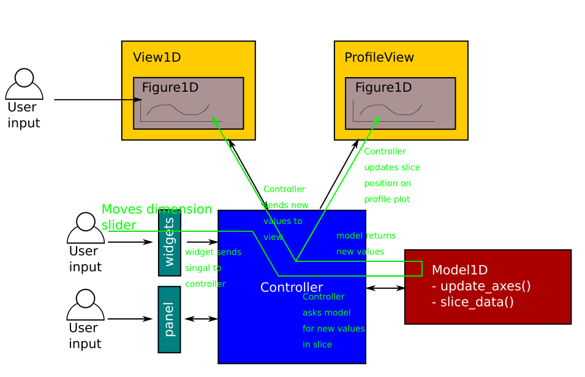
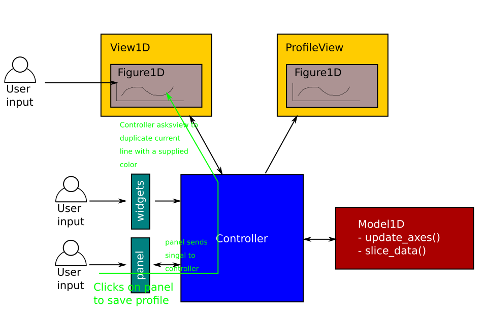
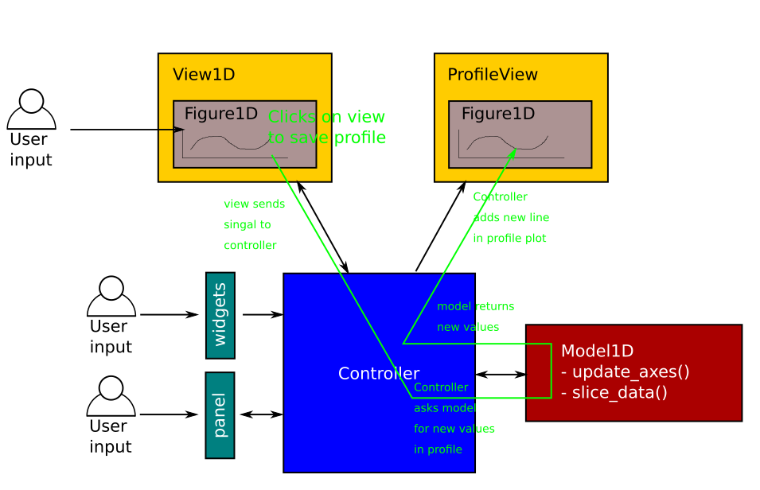
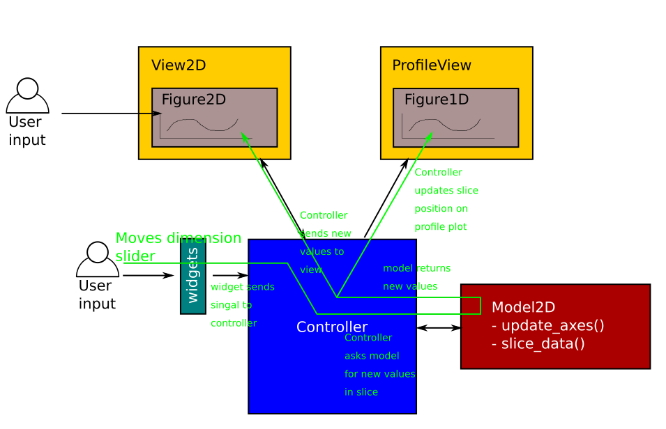

ADR 0003: Refactor plotting code to use Model-View-Controller design pattern
============================================================================

- Status: accepted
- Deciders: Neil, Simon, Owen, Matthew A.
- Date: October 2020

Context
-------

Adding further functionality to the plotting was becoming difficult and messy for a number of reasons:

- A complicated class inheritance setup
- Bad naming for classes and functions (e.g. the ``Slicer`` class that provided the slider widgets)
- The files in the ``plot`` directory were getting longer and longer

There was also no real unit testing for the different components of the plotting objects.
Only the higher level plotting functions were tested with various input arguments, and tests were deemed to have passed as long as no error was thrown in the process of creating the plot.

There was a great need to elevate the plotting code to the same standards as the rest of the codebase, with a modular design and full test coverage.

Decision
--------

Refactor the entire plotting code by implementing a Model-View-Controller pattern.
Instead of using many levels of inheritance to piece together a plot object, we use composition to give a ``SciPlot`` object the various components it needs to function.
It contains:
- a ``model``: contains the input data and performs all the heavy calculations.
- a ``view``: contains a ``figure`` which is displayed and handles communications between ``controller`` and ``figure``, as well as updating the ``profile`` depending on signals captured by the ``figure``.
- some ``widgets``: a base collection of sliders and buttons which provide interactivity to the user.
- a ``panel`` (optional): an extra set of widgets which is not part of the base ``widgets``.
- a ``profile`` (optional): used to display a profile plot under the ``figure`` to show one of the slider dimensions as a 1 dimensional line plot.
- a ``controller``: handles all the communication between all the pieces above.

The files were broken up into smaller pieces, and inheritance was used wherever it made sense, by providing base ``model``, ``view`` and ``figure`` classes.

Below are some examples of event flow in the new pattern.

Moving the slider in a 1D plot:

Saving a line from the panel buttons in a 1D plot:

Clicking on the 1d view to save a profile:

Moving the slider in a 2D plot:

Consequences
------------

Positive:
~~~~~~~~~

- Improved readability, maintainability and flexibility.
- Opens the way for extensive unit testing, probably via mocking.

Negative:
~~~~~~~~~
