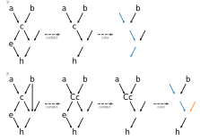
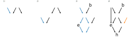

ADR 0011: Renaming of Dimensions in ``transform_coords``
========================================================

- Status: accepted
- Deciders: Jan-Lukas, Neil, Simon
- Date: 2021-12-15

Context
-------

:py:func:`scipp.transform_coords` computes new coordinates from other coordinates and attributes.
This is often used to express conversions of dimension-coordinates to a single output such as ``datetime`` to ``local_time`` in the user guide or ``tof`` to ``wavelength`` in Scippneutron.
As those represent changes of coordinate systems, it makes sense to change the names of dimensions as well.

Since :py:func:`scipp.transform_coords` is a general purpose function, it cannot make assumptions about the meaning of coordinates.
Any algorithm that determines how dimensions are renamed must therefore be based solely on the input data (``DataArray`` / ``Dataset`` and ``graph``).
It must furthermore not depend on the order the graph is traversed in, as that order is an implementation detail.
When there is more than one possible choice how dimensions can be renamed, it is better to not rename at all and leave it up to the user's judgment.

Transformations are encoded as directed acyclic graphs.
Associating outputs with dimensions can be expressed in terms of coloring those graphs.
Each dimension has a unique color and nodes (coordinates) associated with that dimension (dimension-coordinates) are painted in that color.

Constraints
~~~~~~~~~~~

Commutability with slicing and concatenating
^^^^^^^^^^^^^^^^^^^^^^^^^^^^^^^^^^^^^^^^^^^^

It would be desirable to handle dimension renaming in such a way that slicing the data in a dimension, transforming coordinates of each slice, and finally concatenating the slices produces the same result as transforming the original coordinates.
This would allow distributing slices over multiple nodes or performing specialized computations on each slice.
It is not possible, however.

Consider the following graph.
In this section and only this section, ``x[x,y]`` denotes a coordinate with name ``x`` and dimensions ``[x,y]``.
In the first case (left), the coordinate transformation is performed on the original coordinates.
The resulting ``c`` has dimensions ``[a,x,b]`` because it depends on two dimension-coordinates and we cannot automatically determine a single dimension to rename.
On the right, the input data is first sliced in dimension ``[a]`` and ``c`` is computed on every slice.
Here, ``b`` is the only dimension-coordinate in the inputs and dimension ``[b]`` is therefore renamed to ``[c]``.
When we finally concatenate the transformed slices, ``c`` has dimensions ``[a,x,c]`` which differ from the result in the left graph.

.. _sec-existing-implementation:

Existing Implementation (v0.8 - v0.10)
~~~~~~~~~~~~~~~~~~~~~~~~~~~~~~~~~~~~~~

The implementation in Scipp versions 0.8 - 0.10 (before this ADR) takes only a single node and its direct children into account when determining if a dimension can be renamed through the edges between those nodes.
This approach is quite simple and works well for many cases.
But it has some shortcomings.

Split-Join
^^^^^^^^^^

In graph 1 below, ``c`` has two colored (dimension-coordinate) parents which means that neither dimension can be renamed.
However, when an extra node ``e`` is inserted (graph 2), ``c`` has only a single colored parent.
Dimension ``a`` is therefore renamed to ``e``.
This is undesirable because the distance between a node and dimension coordinates should not matter, ``b`` is an ancestor of ``c`` in both cases.

.. image:: ../../images/transform_coords/split-join.svg
  :width: 360
  :alt: split-join graph

Cycles
^^^^^^

All graphs used by :py:func:`scipp.transform_coords` must be directed and acyclic in order to ensure that all inputs to a node are available before processing that node.
This does, however, allow for undirected cycles.
An example of which is given below.
Node ``d`` can be uniquely associated with ``a`` in this case.
This would allow renaming dimension ``a`` to ``d``.
The purely local rule in versions 0.8 - 0.10 does not, however, rename as it treats the ``{a,b,c}`` and ``{b,c,d}`` subgraphs separately.

Alternatives
------------

.. _sec-global-coloring:

Global Coloring
~~~~~~~~~~~~~~~

Cycles can be handled by taking the whole graph into account when coloring nodes.
At a high level the corresponding algorithm is

1. For each dimension-coordinate, color all nodes that depend on this coordinate (transitively) with the corresponding color.
   Allow multiple colors per node.
2. Let ``N`` be the set of all output nodes.
3. Remove all nodes with more than one color and all nodes that share a color with other nodes from ``N``.
4. Add all parents of the removed nodes in 3. to ``N``.
5. Repeat 3-5 until there are no parents left or no nodes are removed in step 3.
6. The remaining nodes in ``N`` are the new dimension-coordinates for their corresponding color.

This approach renames ``a`` to ``d`` in the cycle graph in section :ref:`sec-existing-implementation`.
But it does not rename ``a`` to ``c`` in the other two graphs of that section, because ``c``, ``d``, and ``e`` all get colored orange, since they depend on ``b``.

Contracting Cycles
~~~~~~~~~~~~~~~~~~

Cycles can also be handled by contracting and thereby removing them from the graph.
The following graphs illustrate the procedure.

In graph 1, there is initially one cycle, ``{c, e, f, h}``.
It is contracted in the first step, producing a new graph with node ``Cef``.
Importantly, inputs and outputs to cycles are preserved.
Inputs and outputs are nodes that only have outgoing or incoming edges in the cycle, respectively.
Edges outside the cycle do not matter.
In graph 1, ``c`` is the only input and ``h`` the only output to the cycle.
After contracting, nodes are colored according to similar rules as in the current implementation but adjusted to fix the split-join issue.
In this case, ``a`` is the only dimension-coordinate and dimension ``a`` is renamed to ``h``.

In graph 2, there are three cycles, ``{c, e, f, h}``, ``{b, c, f}``, ``{b, c, e, f, h}``.
We need to choose one to contract.
Different choices produce different final graphs, but those graphs are all equivalent.
Here, we choose ``{b, c, f}`` and contract it.
Note that ``c`` is the only inner node of the cycle.
But the contraction still produces a new node and crucially removes the ``(b, f)`` edge.
Next, the last remaining cycle, ``{Cc, e, f, h}``, is contracted as in graph 1.
Finally, the graph is colored in.
Now, for exposition, both ``a`` and ``d`` are dimension-coordinates.
This means that neither ``Cef`` nor ``h`` can be colored.
Therefore, dimension ``d`` is not renamed.
``a`` could in principle be renamed to ``c`` but ``c`` is excluded from renaming because it is in a cycle.
(It does not matter that the cycle contains only a single node. In general, cycles represent multiple nodes and do not represent dimensions that can be renamed.)

While this algorithm works as desired, it is fairly complicated.

Decision
--------

Similarly to :ref:`sec-global-coloring`, color all nodes that (transitively) depend on a dimension-coordinate with the corresponding color.
Nodes can have multiple colors and keep track of the 'amount' of each color as illustrated by the graphs below.

1. The inputs ``a`` and ``b`` are dimension-coordinates and are assigned 'pure' colors.
   That is, ``a`` has 1 blue (its own color) and 0 orange (``b``'s color) and ``b`` is the other way around.
   ``a`` has a single child, ``c``, and propagates its color fully.
   But ``b`` has two children and only propagates half of its color to each.
   ``c`` therefore is fully blue and only partially orange and as a result is painted blue.
   ``d`` has only a partial color and thus remains black.
2. ``e`` propagates its colors to ``c``.
   And the end result in this case is the same as in 1.
   The disparity between those two cases of the original algorithm is thus fixed.
3. ``c`` propagates half of its color to ``e`` and ``f`` which in turn combine their colors in ``h``.
   As a result, ``h`` has a full contribution from blue, that is dimension ``a``, and ``a`` is renamed to ``h``.
4. In this case, ``a``'s color is divided twice, once at ``a`` itself and once at ``c``.
   As a result, most nodes have a fractional color and can therefore not be associated with dimension ``a``.
   The final node, ``h`` receives full contributions from both ``a`` and ``d``, meaning that those colors cancel.

In summary, every node propagates all its colors to all its children.
In the case of multiple children, the color is divided among them evenly resulting in fractional colors.
Colors from all parents of a node are added up.
Only nodes that have a 1, i.e. full contribution of one and only one color can participate in renaming.
Rename each dimension to the coordinate name that satisfies this criterion and is the farthest removed from the input.

Consequences
------------

Positive:
~~~~~~~~~

- Automated renaming of dimensions that should always do 'the right thing' or nothing.
- Dimension renaming can happen through undirected cycles.
- Split-join type graphs are handled consistently, distances between nodes nodes not matter.
- Simpler to implement than the alternative of contracting cycles.

Negative:
~~~~~~~~~

- More complicated than the existing algorithm.
