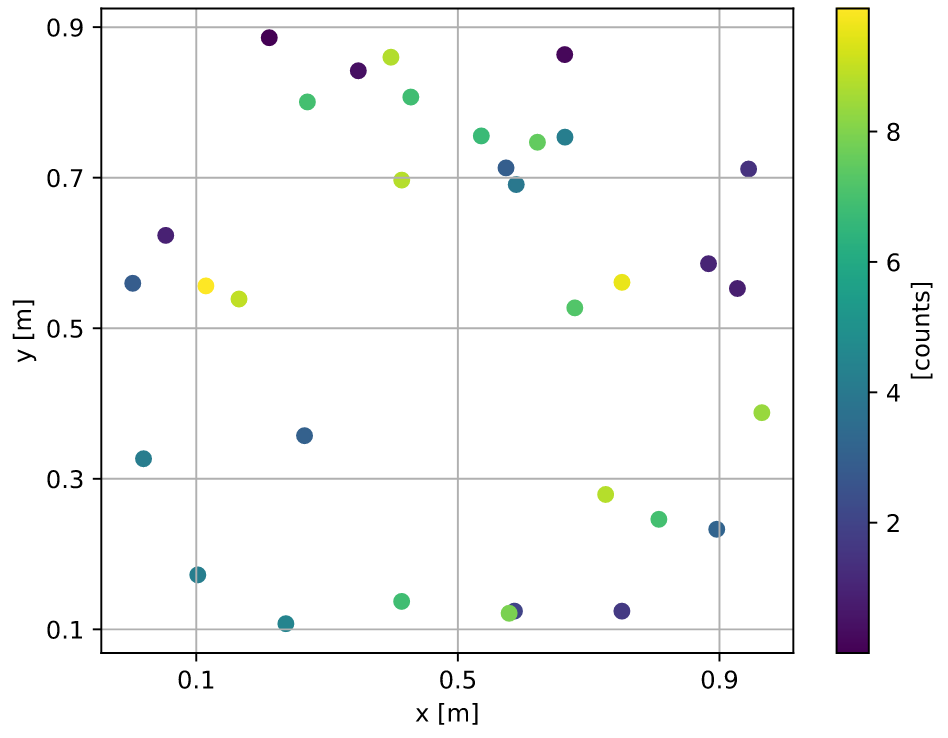
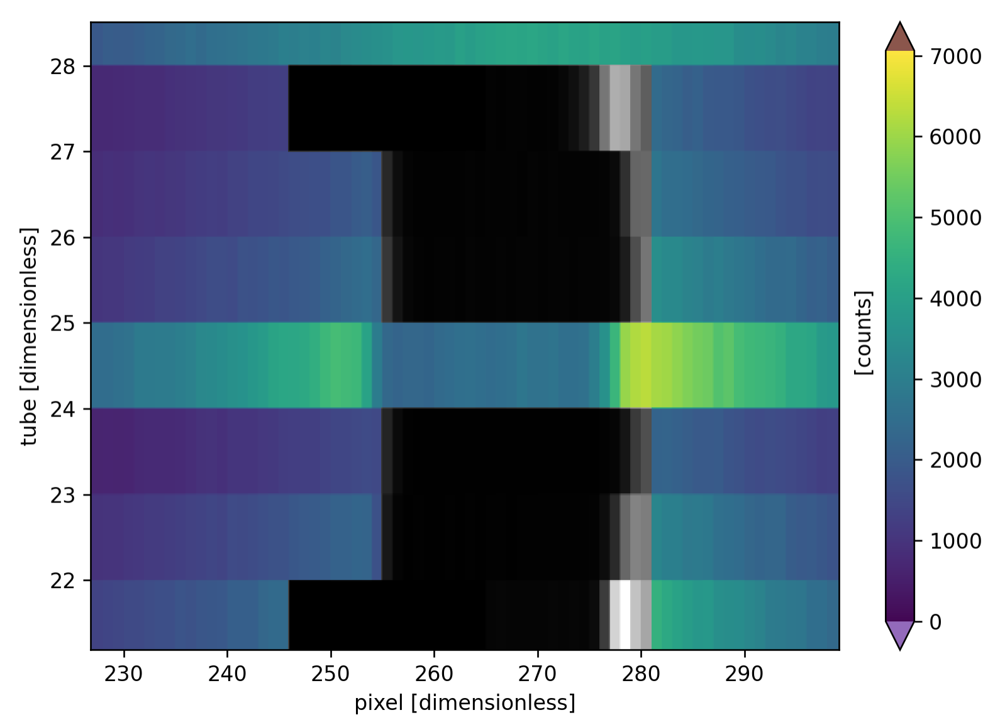
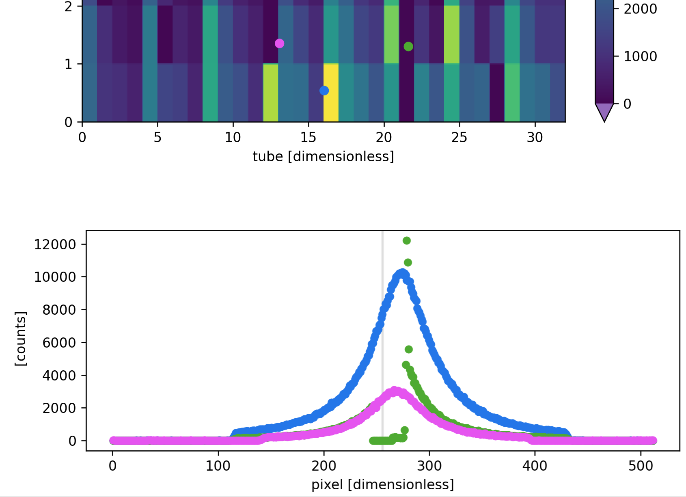
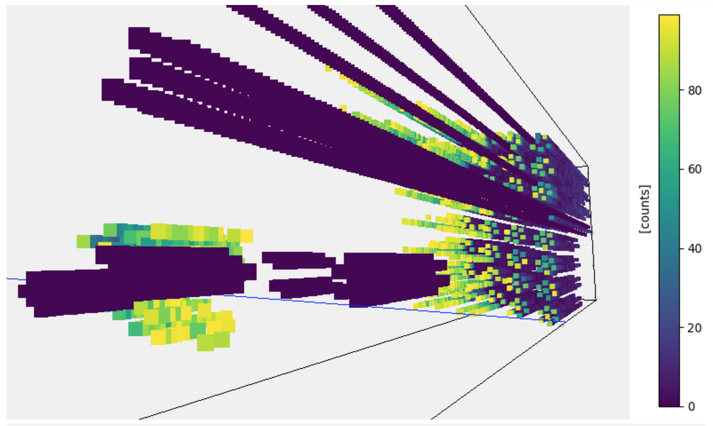
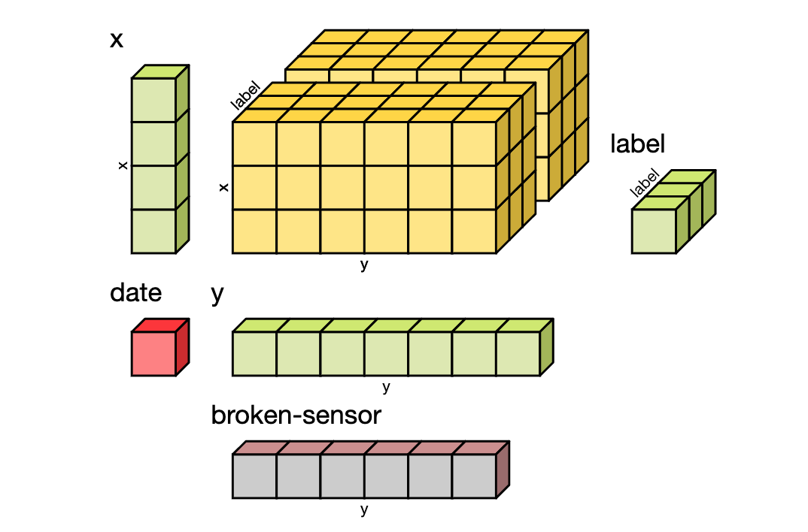

|data-structures| |plotting| |masking|
|binning| |slicing| |scipp-neutron|

.. |data-structures| image:: _static/title-repr-html.png
   :width: 33%
   :target: user-guide/data-structures.html

scipp - Multi-dimensional data arrays with labeled dimensions
=============================================================

**scipp** is heavily inspired by `xarray <https://xarray.pydata.org>`_.
It enriches raw NumPy-like multi-dimensional arrays of data by adding named dimensions and associated coordinates.
Multiple arrays can be combined into datasets.
While for many applications xarray is certainly more suitable (and definitely much more matured) than scipp, there is a number of features missing in other situations.
If your use case requires one or several of the items on the following list, using scipp may be worth considering:

- **Physical units** are stored with each data or coord array and are handled in arithmetic operations.
- **Propagation of uncertainties**.
- Support for **histograms**, i.e., **bin-edge axes**, which are by 1 longer than the data extent.
- Support for scattered data and **non-destructive binning**.
  This includes first and foremost **event data**, a particular form of sparse data with arrays of random-length lists, with very small list entries.
- Support for **masks stored with data**.
- Written in C++ for better performance (for certain applications), in combination with Python bindings.

Generic functionality of scipp is provided in the **scipp** Python module.
In addition, more specific functionality is made available in other modules.
Currently the only example for this is **scipp.neutron** for handling data from neutron-scattering experiments.

Where can I get help?
---------------------

For questions not answered in the documentation
`this page <https://github.com/scipp/scipp/issues?utf8=%E2%9C%93&q=label%3Aquestion>`_
provides a forum with discussions on problems already met/solved in the community.

New question can be asked by
`opening <https://github.com/scipp/scipp/issues/new?assignees=&labels=question&template=question.md&title=>`_
a new |QuestionLabel|_ issue.

.. |QuestionLabel| image:: images/question.png
.. _QuestionLabel: https://github.com/scipp/scipp/issues/new?assignees=&labels=question&template=question.md&title=

Documentation
=============

.. toctree::
   :caption: Getting Started
   :maxdepth: 3

   getting-started/overview
   getting-started/faq
   getting-started/installation
   getting-started/quick-start

.. toctree::
   :caption: User Guide
   :maxdepth: 3

   user-guide/data-structures
   user-guide/slicing
   user-guide/computation
   user-guide/masking
   user-guide/binned-data
   user-guide/groupby
   user-guide/reading-and-writing-files
   user-guide/how_to
   user-guide/tips-tricks-and-anti-patterns

.. toctree::
   :caption: Visualization
   :maxdepth: 3

   visualization/representations-and-tables
   visualization/plotting-overview
   visualization/plotting-1d-data
   visualization/plotting-2d-data
   visualization/plotting-nd-data
   visualization/customizing-figures

.. toctree::
   :caption: Tutorials
   :maxdepth: 3

   tutorials/introduction
   tutorials/multi-d-datasets
   tutorials/neutron-diffraction

.. toctree::
   :caption: Reference
   :maxdepth: 3

   python-reference/api
   python-reference/dtype
   python-reference/units
   python-reference/error-propagation
   python-reference/runtime-configuration

.. toctree::
   :caption: Neutron-scattering
   :maxdepth: 3

   scipp-neutron/overview
   scipp-neutron/groupby
   scipp-neutron/diffraction
   scipp-neutron/from-mantid-to-scipp
   scipp-neutron/instrument-view

.. toctree::
   :caption: Developer Documentation
   :maxdepth: 2

   developer/getting-started
   developer/tooling
   developer/dependencies
   developer/coding-conventions
   developer/how-to
   developer/transform
   developer/constructing_variables
   developer/variable_implementation
   developer/customizing
   developer/api
   developer/concepts
   developer/architecture-decision-records

.. toctree::
   :caption: About
   :maxdepth: 3

   about/about
   about/roadmap
   about/contributing
   about/release-notes
