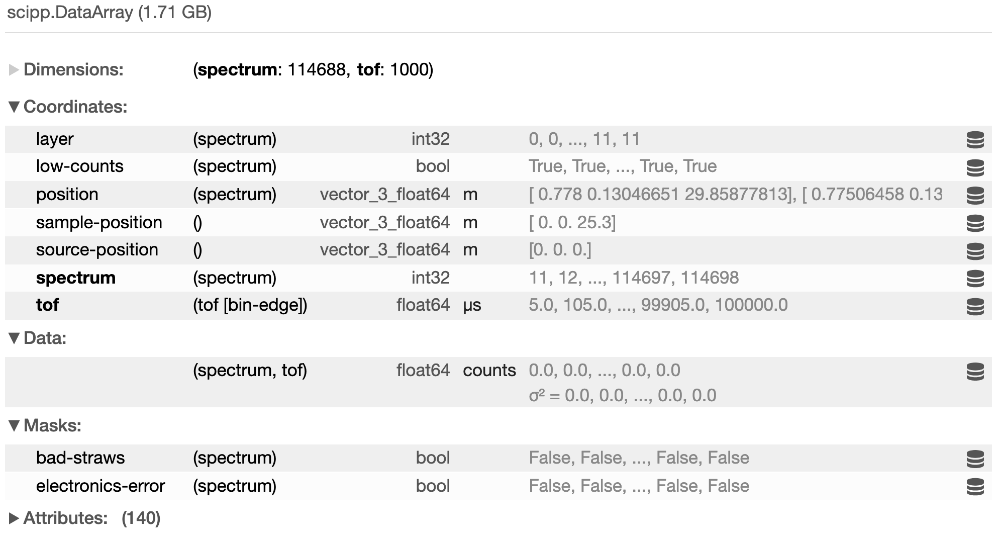

Scipp -- Multi-dimensional data arrays with labeled dimensions
==============================================================

.. raw:: html

   
      A Python library enabling a modern and intuitive way of working with scientific data in Jupyter notebooks
   

|repr-html| |filtering| |show-svg|

.. |filtering| image:: _static/title-filtering-1d-plot.svg
   :width: 32%

.. |show-svg| image:: _static/title-show-svg.png
   :width: 32%

Scipp is heavily inspired by `Xarray <https://xarray.pydata.org>`_.
It enriches raw NumPy-like multi-dimensional arrays of data by adding named dimensions and associated coordinates.
Multiple arrays can be combined into datasets.
While for many applications Xarray is more suitable and matured than Scipp, there is a number of features missing in other situations.
If your use case requires one or several of the items on the following list, using Scipp may be worth considering:

- **Physical units** are stored with each data or coord array and are handled in arithmetic operations.
- **Histograms**, i.e., **bin-edge axes**, which are by 1 longer than the data extent.
- Support for non-regular or scattered data and **non-destructive binning**.
- Support for **masks stored with data**.
- **Propagation of uncertainties**.
- Internals written in C++ for better performance (for certain applications), in combination with Python bindings.

Generic functionality of Scipp is provided in the **scipp** Python package.
In addition, more specific functionality is made available in other packages.
Examples for this are `Plopp <https://scipp.github.io/plopp>`_ for data visualization, `ScippNexus <https://scipp.github.io/scippnexus>`_ for loading NeXus files, and `ScippNeutron <https://scipp.github.io/scippneutron>`_ for handling data from neutron-scattering experiments.

Lost? New to Scipp? Start Here!
-------------------------------

The **Getting Started** section motivates Scipp in `What is Scipp? <getting-started/overview.rst>`_, provides `installation instructions <getting-started/installation.rst>`_, and gives a brief overview in `Quick start <getting-started/quick-start.ipynb>`_.

The **User Guide** provides a high-level overview of the most important Scipp concepts and features.
Read `Data Structures <user-guide/data-structures.ipynb>`_, `Slicing <user-guide/slicing.ipynb>`_, and `Computation <user-guide/computation.ipynb>`_ (in this order) to develop an understanding of the core concepts of Scipp.

Further sections of the User Guide are optional and can be studied in arbitrary order.
Depending on your area of application you may be most interested in `Binned Data <user-guide/binned-data.rst>`_, `Coordinate Transformations <user-guide/coordinate-transformations.rst>`_,
`GroupBy <user-guide/groupby.rst>`_, or
`Masking <user-guide/masking.rst>`_.
The combination of these features is what sets Scipp apart from other Python libraries.
Make sure to also check out `Representations and Tables <user-guide/representations-and-tables.rst>`_ and `Plotting <user-guide/plotting.rst>`_ for an overview of Scipp's powerful visualization features.

The **Reference** documentation section provides a detailed listing of all functions and classes of Scipp, as well as some more technical documentation.
If you are looking for something in particular, use the **Search the docs** function in the left navigation panel.

Where can I get help?
---------------------

We strive to keep our documentation complete and up-to-date.
However, we cannot cover all use-cases and questions users may have.

We use GitHub's `discussions <https://github.com/scipp/scipp/discussions>`_ forum for questions
that are not answered by these documentation pages.
This space can be used to both search through problems already met/solved in the community
and open new discussions if none of the existing ones provide a satisfactory answer.

.. toctree::
   :hidden:

   getting-started/index
   user-guide/index
   reference/index
   development/index
   about/index
