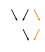

ADR 0011: Renaming of Dimensions in ``transform_coords``
========================================================

- Status: accepted
- Deciders: Jan-Lukas, Neil, Simon
- Date: 2021-12-10

Context
-------

:py:func:`scipp.transform_coords` computes new coordinates from other coordinates and attributes.
This is often used to express conversion of dimension-coordinates to a single output such as ``datetime`` to ``local_time`` in the user guide or ``tof`` to ``wavelength`` in scippneutron.
As those represent changes of coordinate systems, it makes sense to change the names of dimensions as well.

Since :py:func:`scipp.transform_coords` is a general purpose function, it cannot make assumptions about the meaning of coordinates.
Any algorithm that determines how dimensions are renamed must therefore be based solely on the input data (``DataArray`` / ``Dataset`` and ``graph``).
It must furthermore not depend on the order the graph is traversed in, as that order is an implementation detail.
When there is more than one possible choice how dimensions can be renamed, it is better to not rename at all and leave it up to the user's judgment.

Constraints
~~~~~~~~~~~

Commutability with slicing and concatenating
^^^^^^^^^^^^^^^^^^^^^^^^^^^^^^^^^^^^^^^^^^^^

It would be desirable to handle dimension renaming in such a way that slicing the data in a dimension, transforming coordinates of each slice, and finally concatenating the slices produces the same result as transforming the original coordinates.
This would allow distributing slices over multiple nodes or performing specialized computations on each slice.
It is not possible, however.

Consider the following graph.
In this section and only this section, ``x[x,y]`` denotes a coordinate with name ``x`` and dimensions ``[x,y]``.
In the first case (left), the coordinate transformation is performed on the original coordinates.
The resulting ``c`` has dimensions ``[a,x,b]`` because it depends on two dimension-coordinates and we cannot automatically determine a single dimension to rename.
On the right, the input data is first sliced in dimension ``[a]`` and ``c`` is computed on every slice.
Here, ``b`` is the only dimension-coordinate in the inputs and dimension ``[b]`` is therefore renamed to ``[c]``.
When we finally concatenate the transformed slices, ``c`` has dimensions ``[a,x,c]`` which differ from the result in the left graph.

.. image:: ../../../images/transform_coords/slice-transform-concat.svg
  :width: 640
  :alt: slice-transform-concat

.. _sec-split-join:

Split-Join
^^^^^^^^^^

Is it possible to rename dimensions in the following graph?
No, it is not without potentially causing confusion, see below.
Users need to apply domain knowledge in order to find good dimension names.

Determining how to rename dimensions can be mapped onto a graph coloring problem because we are looking for unique associations between nodes.
From now on, colors indicate dimension-coordinates and associated output coordinates.

.. image:: ../../../images/transform_coords/split-join.svg
  :width: 128
  :alt: split-join

Split-Join (1) ``a`` ➔ ``c``
""""""""""""""""""""""""""""

Is it possible to rename ``a`` to ``c``?
This is reasonable at a first glance because there is no unique output dimension for ``b`` as it has two children.
So ``a`` could be seen as the dimension-coordinate parent of ``c``.
But this can produce surprising results.

Consider the following which is a simplified graph of what is used in time-of-flight neutron scattering.
Allowing ``a`` ➔ ``c`` renaming, the left graph renames the time dimension ``tof`` to the wavelength dimension ``λ``.
This is a common conversion and makes sense for scientists in neutron scattering.
If, however, the graph is altered to the one on the right, the ``pos`` dimension is renamed to ``λ`` while ``tof`` is left as is.
This is surprising and usually undesired.

Split-Join (2) ``b`` ➔ ``d``
""""""""""""""""""""""""""""

Is it possible to rename ``b`` to ``d``?
We could apply the inverse of the argument from the previous section.
``c`` depends on two dimension-coordinates and can thus not become a new dimension-coordinate.
This leaves ``d`` free to replace ``b``.

This approach breaks in larger graphs.
In the graph below, ``b`` would be renamed to ``e`` because the latter depends only on one dimension-coordinate, ``d``.
But considering the graph as a whole, ``e`` depends on two dimension-coordinates, ``a`` and ``b``.
Allowing ``b`` ➔ ``d`` would therefore break the rule that there must be a unique association of dimension coordinates with outputs.

.. _sec-existing-implementation:

Existing Implementation (v0.8 - v0.10)
~~~~~~~~~~~~~~~~~~~~~~~~~~~~~~~~~~~~~~

The implementation in scipp versions 0.8 - 0.10 (before this ADR) uses local rules to propagate colors through graphs.
This allows for cases where dimensions are renamed even though a coordinate has more than one dimension-coordinate as ancestor if those ancestors are sufficiently far removed.

For instance, extending the graph from section :ref:`sec-split-join` by one node as shown below, allows renaming of dimension ``a`` to ``e``.
``b`` cannot be renamed to either ``c`` or ``d``.
But ``b`` is not taken into account for ``e`` because ``c`` separates the two.
This behavior is beneficial as it encapsulates contributions from dimension coordinates.
It furthermore allows splitting the graph into steps that can be done separately (``b`` ➔ (``c``, ``d``) followed by (``a``, ``c``) ➔ ``e``).

All graphs used by :py:func:`scipp.transform_coords` must be directed acyclic in order to ensure that all inputs to a node are available before processing that node.
This does, however, allow for undirected cycles.
An example is given below.

Node ``d`` can be uniquely associated with ``a`` in this case.
This would allow renaming dimension ``a`` to ``d``.
The purely local rule in versions 0.8 - 0.10 does not, however, rename as it treats the ``{a,b,c}`` and ``{b,c,d}`` subgraphs separately.

.. image:: ../../../images/transform_coords/cycle.svg
  :width: 100
  :alt: cycle graph

Alternatives
------------

Global Coloring
~~~~~~~~~~~~~~~

Cycles can be handled by taking the whole graph into account when coloring nodes.
At a high level the corresponding algorithm is

1. For each dimension-coordinate, color all nodes that depend on this coordinate (transitively) with the corresponding color.
   Allow multiple colors per node.
2. Let ``N`` be the set of all output nodes.
3. Remove all nodes with more than one color and all nodes that share a color with other nodes from ``N``.
4. Add all parents of the removed nodes in 3. to ``N``.
5. Repeat until there are no parents left or no nodes are removed in step 3.
6. The remaining nodes in ``N`` are the new dimension-coordinates for their corresponding color.

This approach renames ``a`` to ``d`` in the cycle graph in section :ref:`sec-existing-implementation`.
But it does not rename ``a`` to ``e`` in the other graph of that section, because ``c``, ``d``, and ``e`` all get colored orange, since they depend on ``b``.

Decision
--------

The algorithm of section :ref:`sec-existing-implementation` works in many cases and has several desirable properties.
In particular, it satisfies all constraints given above.
Its main shortcoming is the handling of cycles.

The solution chosen here builds on top of the old algorithm.
It handles cycles by contracting them to produce graphs without and (undirected) cycles and then colors the nodes using local rules.
The following graphs illustrate the procedure.

In graph 1, there is initially one cycle, ``{c, e, f, h}``.
It is contracted in the first step, producing a new graph with node ``Cef``.
Importantly, inputs and outputs to cycles are preserved.
Inputs and outputs are nodes that only have outgoing or incoming edges in the cycle, respectively.
Edges outside the cycle do not matter.
In graph 1, ``c`` is the only input and ``h`` the only output to the cycle.
After contracting, nodes are colored in according to the rules described below.
In this case, ``a`` is the only dimension-coordinate and dimension ``a`` is renamed to ``h``.

In graph 2, there are three cycles, ``{c, e, f, h}``, ``{b, c, f}``, ``{b, c, e, f, h}``.
We need to choose one to contract.
Different choices produce different final graphs, but those graphs are all equivalent.
Here, we choose ``{b, c, f}`` and contract it.
Note that ``c`` is the only inner node of the cycle.
But the contraction still produces a new node and crucially removed the ``(b, f)`` edge.
Next, the last remaining cycle, ``{Cc, e, f, h}``, is contracted as in graph 1.
Finally, the graph is colored in.
Now, for exposition, both ``a`` and ``d`` are dimension-coordinates.
This means that neither ``Cef`` nor ``h`` can be colored.
Therefore, dimension ``d`` is not renamed.
``a`` could in principle be renamed to ``c`` but ``c`` is excluded from renaming because it is in a cycle.
(It does not matter that the cycle contains only a single node. In general, cycles represent multiple nodes and do not represent dimensions that can be renamed.)

.. image:: ../../../images/transform_coords/cycle-contraction.svg
  :width: 640
  :alt: cycle graph

Nodes are colored by first giving every dimension-coordinate its own color.
Those colors are then propagated through the graph following these rules:

1. If a node has exactly one colored parent, use that parent's color.
2. If a node has several colored parents, leave the node black (uncolored).
3. If a node has more than one child, all its children are black.

This produces a chain of nodes for each color.
Dimensions are renamed to the last node in its chain, excluding cycle nodes.

Consequences
------------

Positive:
~~~~~~~~~

- Automated renaming of dimensions that should always do 'the right thing' or nothing.
- Dimension renaming can happen through undirected cycles.

Negative:
~~~~~~~~~

- The algorithm is fairly complicated given how small a task it achieves.
