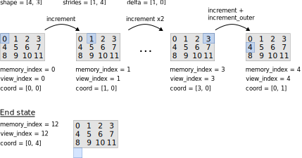
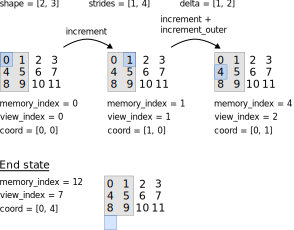
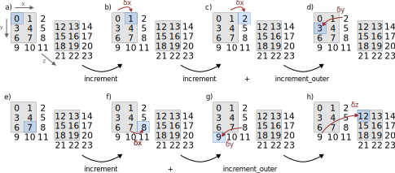
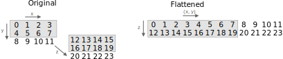
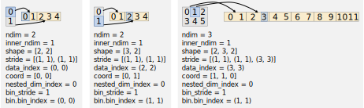

Multi-Dimensional Indexing
==========================

ViewIndex
---------

``ViewIndex`` is used by ``ElementArrayView`` to access elements of variables both in sequence and in random order.
It has the following attributes:

 * ``m_ndim``: Number of dimensions of the view.
 * ``m_shape``: Shape of the view.
 * ``m_strides``: Strides in memory for each dimension.
 * ``m_delta``: Step length in memory for each dimension for incrementing the index.
 * ``m_memory_index``: Flat index into the underlying memory buffer.
 * ``m_view_index``: Flat index according to the view of the memory, differs from ``m_memory_index`` in case of slicing or broadcasting.
 * ``m_coord``: Indices for each dimension according to the view.

.. caution::
    Internally, arrays are stored such that ``m_shape[0]`` corresponds to the fastest-running dimension.
    ``MultiIndex`` works the same way.
    But all other classes, e.g. ``Dimensions`` and ``Variable``, use the reverse storage order.

Incrementing
^^^^^^^^^^^^

This section shows how the class attributes are used to increment a ``ViewIndex``.
Details on their construction can be found below.

Given an complete view of a memory buffer, the image below shows the state of a
``ViewIndex`` after calling ``ViewIndex::increment()``.
The numbers in the gray box are indices into memory and arranged according to the shape of the view.
The blue box indicates the location that the ``ViewIndex`` currently refers to.

The figure also shows the state indicating the end of iteration.
The end state is always ``coord[ndim-1] == shape[ndim-1]`` and ``coord[d] == 0`` for ``d < ndim-1``.

.. attention::
    This is not exactly how ViewIndex is implemented. See the section on `Flattening Dimensions`_ below.

The behavior is similar on a partial view of the data as shown below.
The gray box indicates the view and the black numbers the actual memory locations.
Note how ``View_index`` advances in a linear fashion and ``memory_index`` keeps track of the actual location in memory.

Meaning of delta
^^^^^^^^^^^^^^^^

``ViewIndex`` uses the special attribute ``m_delta`` which is similar to but not the same as strides.
``delta`` is the step length per dimension to be used in calls to ``ViewIndex::increment``.

Starting at a) in the figure below, calling ``increment`` moves to b) by adding ``delta[x]`` to ``m_memory_index``.
In the next step, ``increment`` moves to element 2 in c) by adding ``delta[x]`` again.
This is is out of bounds and therefore ``increment_outer`` is called which moves to
element 3 in d) by adding ``delta[y]`` and returns.
Skipping some steps, at the end of dimension y going from e) to f), ``increment``
calls ``increment_outer`` again which first moves to 9 and then 12.
Note that states c), f), and g) are only intermediate and not visible from the outside.

We can see that ``delta[dim]`` takes a step in direction ``dim`` but also rewinds the previous dimension to its beginning.
Furthermore, we always start one element past the end of the previous dimension.
This means that

.. code-block:: python

    if dim == 0:
        delta[dim] = stride[dim]
    else:
        delta[dim] = stride[dim] - shape[dim-1] * stride[dim-1]

``m_strides`` is strictly speaking redundant given ``m_delta`` and ``m_shape``.
It is stored nonetheless because it simplifies the implementation of ``ViewIndex::set_index``.

Flattening Dimensions
^^^^^^^^^^^^^^^^^^^^^

From a usage perspective, ``ViewIndex`` provides a flat view of some memory.
We can thus modify the internal shape as long as we preserve the iteration order.
This is useful when multiple dimensions are laid out contiguously in memory.
This is the case for x and y in the figure below.

``ViewIndex`` uses this by flattening out x and y and internally producing a 2-dimensional
view as shown on the right hand side in the figure.
This is invisible from the outside but reduces the loop lengths in both ``ViewIndex::increment`` and ``ViewIndex::set_index``.

Contiguous layouts are identified by ``delta[dim] == 0 and strides[dim] != 0`` (with ``dim == y`` in this case).
The condition on strides is required to support broadcasting where the extra dimension needs to be retained.

MultiIndex
----------

``MultiIndex`` is used by ``transform`` to iterate over all inputs and outputs at the same time.
It functions in a similar way to ``ViewIndex`` but also supports iteration over multiple variables
as well as binned data.
The handling of the latter is described in `Binned Data`_.

In contrast to ``ViewIndex``, ``MultiIndex`` does not use ``delta`` but instead computes the step lengths
in the various ``increment_*`` functions on the fly from ``m_strides`` and ``m_shape``.
This is because ``delta`` would need to be recomputed for every bin.

``MultiIndex::m_data_index`` corresponds to ``ViewIndex::m_memory_index``.
But there is no equivalent of ``ViewIndex::m_view_index`` as that is not required by ``transform``.

Similarly to ``ViewIndex``, ``MultiIndex`` flattens dimensions during construction but only
if the corresponding memory layout is contiguous in all operands.
Iteration functions in much the same way as described in `Incrementing`_ above.

The image below shows some examples of possible states of ``MultiIndex`` (without flattening contiguous dimensions).
The left and center case correspond to unary operations and the one to the right to a binary operation
with broadcasting in the second operand.
Note that there is always one additional operand, e.g. on the left, ``data_index`` has two elements,
the one listed first is the output ``Variable``.

.. image:: ../../images/multi_dimensional_indexing/multi_index_dense_setups.svg
  :width: 640
  :alt: Example setups of MultiIndex with dense data

Here, '∅' denotes ignored members.
Square brackets denote arrays in the number of dimensions and round parentheses denote arrays in the number of operands.

Binned Data
^^^^^^^^^^^

Conceptually, binned data is handled by nesting two MultiIndices, the inner iterates over the contents of a bin,
while the outer iterates over bin indices.
Every time the outer moves to another bin, it loads the corresponding parameters and initializes the inner index.

In practice, the implementation inlines the inner index into the outer such that ``m_ndim`` is the total number of
dimensions and arrays like ``m_shape`` have elements for both inner and outer dimensions.
Dimensions inside the bins come first in those arrays.

The images below show examples of ``MultiIndex`` with binned data.
Gray boxes denote bin indices and yellow boxes denote bin contents.
Arrows show which bins the indices refer to.

The left and center cases show one-dimensional indices with one-dimensional bins.
Note how the ``shape`` varies between the two cases because a different bin has been loaded (``bin.bin_index``).
Multi-dimensional indices with one-dimensional bins are handled in the same way.

Multi-dimensional bins are more complicated.
The image on the left shows bins of a buffer that was sliced in the inner dimension and on the right
it has been sliced in the outer dimension.
This is indicated by ``m_nested_dim_index`` and ``m_bin_stride`` is the distance in memory
when incrementing ``m_nested_dim_index``.

.. image:: ../../images/multi_dimensional_indexing/multi_index_binned_2d_setups.svg
  :width: 480
  :alt: Example setups of MultiIndex with data with 2 dimensional bins
